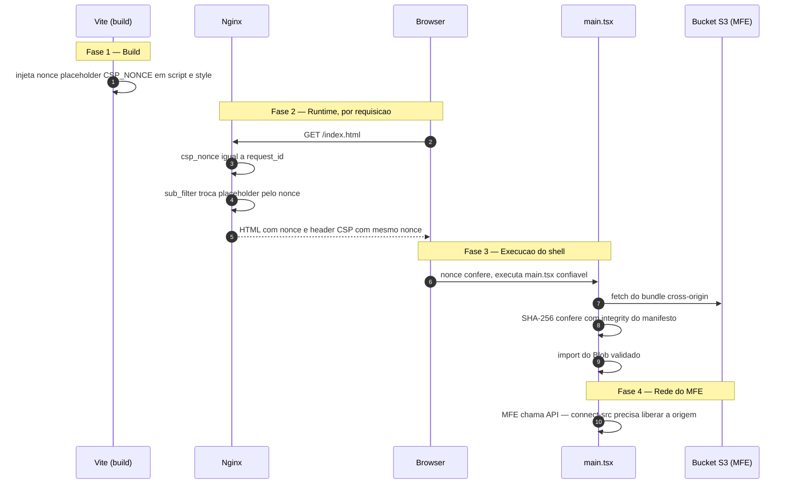

# Política de Segurança

Este documento é a referência de segurança do `frontend-react`. Ele descreve o
modelo de ameaças, os cabeçalhos de segurança aplicados, a mecânica que permite
carregar microfrontends de terceiros com segurança e os procedimentos de
rollout. As decisões aqui descritas estão formalizadas nos ADRs (Architecture
Decision Records) referenciados ao final.

> Acrônimos definidos no primeiro uso. CSP (Content Security Policy);
> MFE (microfrontend); ESM (ECMAScript Modules); XSS (Cross-Site Scripting);
> DOM (Document Object Model); HSTS (HTTP Strict Transport Security);
> COOP (Cross-Origin-Opener-Policy); COEP (Cross-Origin-Embedder-Policy);
> CORP (Cross-Origin-Resource-Policy); CORS (Cross-Origin Resource Sharing);
> HMR (Hot Module Replacement); MSW (Mock Service Worker);
> CDN (Content Delivery Network);
> CSPRNG (Cryptographically Secure Pseudo-Random Number Generator).

---

## 1. Visão geral

O `frontend-react` é o **shell nuclear** de uma plataforma de microfrontends
(MFEs) dinâmicos. O shell não embute os MFEs em tempo de build: ele os carrega
em runtime, sob demanda, via `import()` ESM (ECMAScript Modules) **cross-origin**
a partir de buckets S3 (Amazon Simple Storage Service) — em desenvolvimento via
LocalStack, em produção via S3 real, eventualmente atrás de uma CDN (Content
Delivery Network). A topologia e o contrato dinâmico estão descritos no
[ADR-008](docs/architecture/adrs/ADR-008-microfrontends-dinamicos.md) e no
[ADR-011](docs/architecture/adrs/ADR-011-deploy-s3-localstack.md).

Essa escolha tem uma consequência direta de segurança: **o shell executa código
de outra origem em tempo de execução**. Cada MFE roda no mesmo contexto do
portal; portanto, isolamento por contrato de `mount`/`unmount` não é uma
fronteira de segurança. Antes de executar um bundle, o shell verifica sua origem
contra uma allowlist e confere o hash SHA-256 declarado no manifesto. Um bundle
adulterado no bucket é recusado.

A CSP (Content Security Policy) é defesa em profundidade. Em vez de permitir
explicitamente cada origem de bucket no `script-src` (o que viraria uma lista de
permissão frágil e crescente), o shell usa **nonce + `strict-dynamic`**: apenas
o script-raiz do shell carrega com um nonce confiável, e a confiança é propagada
ao `import()` dos MFEs pelo próprio navegador (ver Seção 4). A CSP transforma a
superfície "qualquer script pode rodar" em "apenas o que o shell originou,
explicitamente, pode rodar". Ela não torna seguro um MFE que já foi aceito pelo
manifesto: esse código é confiável para fins de execução e deve ser tratado como
parte do perímetro de confiança.

A política completa está formalizada no
[ADR-012](docs/architecture/adrs/ADR-012-content-security-policy.md)
(recursos) e no
[ADR-013](docs/architecture/adrs/ADR-013-trusted-types-e-reporting.md)
(Trusted Types e Reporting).

---

## 2. Modelo de ameaças

| Ameaça | Vetor | Mitigação |
| --- | --- | --- |
| **XSS (inline/injeção)** | Script inline injetado, atributo de evento, ou string maliciosa promovida a `<script>` | `script-src 'nonce-$csp_nonce' 'strict-dynamic'` — apenas scripts com o nonce do request executam; sem o nonce, scripts injetados são bloqueados. Trusted Types (`require-trusted-types-for 'script'`) sinaliza — e, após a migração para enforcement, impedirá — que strings cruas virem código via sinks do DOM (hoje em Report-Only, ver Seção 5). |
| **Clickjacking** | Página embutida em `<iframe>` de site malicioso para capturar cliques | `frame-ancestors 'none'` — o portal não pode ser embutido em frame algum, em nenhuma origem. |
| **Supply-chain via MFE comprometido** | Bucket S3 adulterado servindo um MFE malicioso | `mfe-manifest.json` declara `integrity` SHA-256; o shell permite apenas origens configuradas em `mfeAllowedOrigins`, baixa o bundle, confere o hash e só então o importa. |
| **Acesso sem autenticação / token forjado** | Chamada direta ao gateway ou Bearer JWT inválido | Gateway valida JWT, algoritmo, assinatura, emissor, audiência e expiração antes de rotear. Tokens ausentes ou inválidos recebem `401`. |
| **Bypass do gateway** | Chamada direta a BFF ou falsificação de cabeçalhos internos | BFFs não publicam portas no host e exigem a chave interna mais identidade injetada pelo gateway; a rede Docker `backend` é interna. |
| **BOLA/IDOR** | Usuário solicita contrato ou proposta de outro usuário | BFF vincula os recursos ao `sub` validado e devolve `404` quando o recurso não pertence à identidade autenticada. |
| **Abuso de lógica de negócio** | Corpo vazio, campos extras ou valores financeiros fora da faixa | Schemas de runtime validam tipo, tamanho, formato e faixa permitida antes de executar operações de mutação. |
| **Exfiltração de dados** | Código injetado abre conexão a um servidor controlado pelo atacante (fetch/beacon/WebSocket) para vazar tokens ou dados do usuário | `connect-src 'self' ${CSP_CONNECT_SRC}` — apenas as origens de API explicitamente liberadas aceitam conexões; `default-src 'none'` fecha qualquer canal não declarado por padrão. |
| **Mixed content** | Recurso `http://` carregado em página `https://`, sujeito a interceptação/injeção | `upgrade-insecure-requests` reescreve requisições inseguras para `https://`; HSTS (`Strict-Transport-Security`) força o navegador a usar TLS por toda a navegação subsequente. |
| **Sequestro de base / forms** | `<base href>` injetado para redirecionar URLs relativas; `action` de formulário reescrito para enviar dados a terceiros | `base-uri 'self'` impede a troca da base do documento; `form-action 'self'` restringe o destino de submissão de formulários à própria origem. |

---

## 3. Cabeçalhos de segurança (referência header-a-header)

Os cabeçalhos são definidos em
[`nginx.conf.template`](nginx.conf.template) e repetidos em cada bloco
`location` (ver Seção 10 sobre a limitação de herança do `add_header`). Os valores
de produção são:

| Header | Valor | Racional |
| --- | --- | --- |
| `Content-Security-Policy` (enforce) | `default-src 'none'; script-src 'nonce-$csp_nonce' 'strict-dynamic' blob: https: 'unsafe-inline'; style-src 'self' 'nonce-$csp_nonce'; img-src 'self' data: blob:; font-src 'self'; connect-src 'self' ${CSP_CONNECT_SRC}; worker-src 'self'; manifest-src 'self'; base-uri 'self'; form-action 'self'; frame-ancestors 'none'; object-src 'none'; upgrade-insecure-requests; report-to csp-endpoint` | Política de recursos em **enforcement**. `default-src 'none'` nega tudo por padrão. `blob:` é necessário porque o bundle já verificado por hash é importado a partir de um Blob local; não deve ser removido sem substituir o mecanismo de integridade. |
| `Content-Security-Policy-Report-Only` | `require-trusted-types-for 'script'; trusted-types default; report-to csp-endpoint` | Trusted Types em **modo observação**: o navegador reporta (mas não bloqueia) usos perigosos de sinks do DOM. Mantido separado do header de enforcement para permitir coletar violações sem quebrar MFEs antes da migração (Seção 9). |
| `Reporting-Endpoints` | `csp-endpoint="${CSP_REPORT_URI}"` | Declara, via Reporting API, o endpoint nomeado `csp-endpoint` referenciado por `report-to` nos dois headers acima. |
| `Strict-Transport-Security` | `max-age=63072000; includeSubDomains` | HSTS por 2 anos, incluindo subdomínios — força TLS e impede downgrade para `http://` após a primeira visita. |
| `X-Content-Type-Options` | `nosniff` | Impede o navegador de adivinhar (sniff) o tipo MIME, evitando que um recurso seja reinterpretado como script. |
| `Referrer-Policy` | `strict-origin-when-cross-origin` | Envia o caminho completo apenas para a mesma origem; entre origens, só a origem; e nada ao fazer downgrade de HTTPS para HTTP. |
| `Permissions-Policy` | `camera=(), microphone=(), geolocation=(), browsing-topics=()` | Desliga câmera, microfone, geolocalização e a API Topics para todas as origens — nenhum MFE pode acessá-las. |
| `Cross-Origin-Opener-Policy` | `same-origin` | COOP isola o grupo de contexto de navegação, cortando referências `window.opener` cross-origin e mitigando ataques de canal lateral entre janelas. |

### Cabeçalhos deliberadamente removidos ou ausentes

- **`X-Frame-Options` removido.** Foi substituído por `frame-ancestors 'none'`,
  que é mais expressivo (aceita lista de origens, não só `DENY`/`SAMEORIGIN`),
  é a diretiva moderna padronizada e tem precedência sobre `X-Frame-Options` nos
  navegadores que suportam CSP. Manter ambos seria redundante e arriscaria
  divergência.
- **`X-XSS-Protection` removido.** O filtro XSS heurístico dos navegadores é
  **obsoleto** (removido do Chrome/Edge) e historicamente **contraproducente**:
  podia introduzir vulnerabilidades próprias. A proteção contra XSS hoje é a CSP.
- **COEP está FORA (intencionalmente).** `Cross-Origin-Embedder-Policy`
  exigiria que **todo** recurso cross-origin — incluindo cada MFE servido pelos
  buckets — respondesse com CORP (Cross-Origin-Resource-Policy) ou passasse por
  CORS (Cross-Origin Resource Sharing) explícito. Sem CORP nos buckets, ativar
  COEP **quebraria o `import()` cross-origin** dos MFEs. Por isso COEP fica
  registrado como evolução futura (Seção 10): só faz sentido habilitá-lo **depois**
  de garantir CORP em todos os buckets de MFE.

---

## 4. Nonce, `strict-dynamic` e integridade de MFEs

O shell baixa MFEs cross-origin sem listá-los no `script-src`. A solução combina
nonce, `strict-dynamic`, allowlist de origem e integridade SHA-256.

**(a) Build — plugin Vite injeta o placeholder.**
Em [`vite.config.ts`](vite.config.ts), o plugin `cspNoncePlugin` roda com
`apply: 'build'` (logo, **não** afeta o dev server) e `enforce: 'post'`. Ele
reescreve as tags `<script>` e `<style>` do HTML gerado, inserindo
`nonce="**CSP_NONCE**"` (o placeholder literal `**CSP_NONCE**`) em toda tag que
ainda não tenha atributo `nonce`. O artefato de build sai com o placeholder, não
com um valor real.

**(b) Runtime — Nginx substitui o placeholder pelo nonce do request.**
Em [`nginx.conf.template`](nginx.conf.template), `set $csp_nonce $request_id;`
deriva o nonce do identificador único da requisição. No `location = /index.html`,
`sub_filter '**CSP_NONCE**' $csp_nonce;` (com `sub_filter_once off;`) troca todas
as ocorrências do placeholder pelo nonce. **O mesmo valor `$csp_nonce`** aparece
no header `Content-Security-Policy` (`script-src 'nonce-$csp_nonce' ...`). Como o
nonce muda a cada request. Ele oferece unicidade operacional, mas não é tratado
como fonte criptograficamente forte; a limitação e a evolução recomendada estão
na Seção 10.

**(c) Browser — o manifesto é validado antes do download.**
A validação em [`manifest.ts`](src/app/mfe/manifest.ts) exige `https:` (exceto
`localhost` em desenvolvimento), rota interna, origem presente em
`mfeAllowedOrigins` e valor `integrity` no formato `sha256-<base64>`.

**(d) O bundle é conferido antes de executar.**
[`loadMfeModule.ts`](src/app/mfe/loadMfeModule.ts) baixa os bytes sem
credenciais, calcula SHA-256 com Web Crypto e compara o resultado ao manifesto.
Somente os bytes aprovados são encapsulados em `Blob` e importados como módulo
ESM. A divergência de hash interrompe o carregamento.

**(e) Browser — `main.tsx` é confiável e `strict-dynamic` propaga a confiança.**
A tag que carrega [`src/main.tsx`](src/main.tsx) traz o nonce correto, então o
navegador a executa. A partir daí, `strict-dynamic` diz ao navegador: "qualquer
script carregado **por** um script já confiável também é confiável, ignorando
listas de origem". O módulo já validado é importado de uma URL `blob:`, por isso
essa origem aparece explicitamente em `script-src`.

**(f) `connect-src` continua restrito — `strict-dynamic` não o cobre.**
`strict-dynamic` afeta apenas o carregamento de **scripts**. Ele **não** libera
conexões de rede. Portanto, as origens das APIs que os MFEs consomem precisam
estar explicitamente em `connect-src` via `${CSP_CONNECT_SRC}` (Seção 8). Um MFE
pode ser carregado (script), mas só falará com as APIs declaradas.



---

## 5. Trusted Types — guia para autores de MFE

Trusted Types está hoje em **Report-Only** (`require-trusted-types-for 'script';
trusted-types default`). Isso significa que o navegador **reporta**, mas **ainda
não bloqueia**, atribuições de strings cruas a sinks perigosos do DOM
(`innerHTML`, `outerHTML`, `document.write`, `eval`, `setAttribute` de eventos,
`src` de `<script>`, etc.). A migração para enforcement está descrita na Seção 9.

**O que evitar.** Não atribua strings cruas a sinks do DOM. O exemplo clássico:

```js
// EVITE — será reportado agora e bloqueado após a migração para enforcement
element.innerHTML = dadosDoUsuario
```

**Como sanitizar.** Prefira APIs seguras por construção (`textContent`,
`createElement` + `append`) ou um sanitizador que produza Trusted Types (por
exemplo, DOMPurify configurado com `RETURN_TRUSTED_TYPE: true`):

```js
element.textContent = dadosDoUsuario // seguro: não interpreta HTML
```

**Como registrar uma Trusted Types policy.** Quando HTML dinâmico for
inevitável, crie uma policy que sanitize a entrada e devolva um valor confiável:

```js
const policy = window.trustedTypes.createPolicy('mfe-emprestimo', {
  createHTML: (input) => DOMPurify.sanitize(input),
})
element.innerHTML = policy.createHTML(dadosDoUsuario)
```

O nome da policy deve ser único por MFE. Note que o header declara
`trusted-types default` — ao migrar para enforcement, a lista de policies
permitidas será ajustada para incluir as policies legítimas de cada MFE.

**Migração para enforcement.** Após o período de observação (Seção 9), o header
`Content-Security-Policy-Report-Only` com as diretivas de Trusted Types passará a
ser emitido como `Content-Security-Policy` (enforcement). A partir daí, qualquer
uso de string crua em sink do DOM **lançará exceção** em vez de apenas reportar.
Autores de MFE devem migrar **antes** dessa virada.

---

## 6. Reporting

As violações de CSP e de Trusted Types são enviadas pelo navegador ao endpoint
nomeado `csp-endpoint`, declarado em `Reporting-Endpoints` e referenciado por
`report-to` nos dois headers de política.

**Configuração.** Defina `${CSP_REPORT_URI}` (Seção 8) com a URL absoluta do seu
coletor de relatórios. O envsubst do Nginx injeta esse valor em
`Reporting-Endpoints: csp-endpoint="${CSP_REPORT_URI}"`.

**Formato.** O navegador faz `POST` ao endpoint com um corpo JSON contendo os
relatórios em lote (cada um com `type`, `url`, `age` e um `body` que descreve a
diretiva violada, o recurso bloqueado e a origem do documento). O coletor deve
responder rápido (tipicamente `204 No Content`) e apenas registrar/agregar.

**Em desenvolvimento.** Não há coletor externo: o handler MSW (Mock Service
Worker) em [`src/mocks/handlers.ts`](src/mocks/handlers.ts) intercepta
`POST /__csp-report`, loga o corpo no console com o prefixo `[csp-report]` e
responde `204`. Em dev, `Reporting-Endpoints` aponta para `/__csp-report` (ver
[`vite.config.ts`](vite.config.ts)), fechando o ciclo localmente sem
infraestrutura.

---

## 7. Autenticação, autorização e fronteira de API

O gateway é a única porta de entrada pública para os BFFs. Antes de aplicar
auditoria, rate limit e proxy, ele exige `Authorization: Bearer <JWT>` e valida
assinatura, algoritmo, emissor, audiência, expiração e formato de `sub`.
Produção usa `RS256` com JWKS; `HS256` com segredo compartilhado é permitido
somente no desenvolvimento.

Após a validação, o gateway remove o header `Authorization` antes de encaminhar
a requisição. Em seu lugar, envia identidade e papéis em headers internos,
acompanhados de `X-Internal-Gateway-Key`. Cada BFF exige a chave e um `sub`
válido antes de montar suas rotas. Essa chave é uma defesa entre serviços, não
substitui a validação do JWT no gateway.

Os BFFs aplicam autorização de objeto usando o `sub`: recursos sem vínculo com a
identidade retornam `404`, evitando enumeração. Entradas mutáveis são validadas
em runtime e o parser JSON aceita no máximo 16 KB; JSON malformado retorna `400`
e corpo acima do limite retorna `413`.

O rate limit usa o `sub` autenticado como chave. A auditoria registra método,
path, BFF de destino, status, duração, IP e correlação de forma assíncrona; o
header de correlação recebido só é aceito se tiver formato e tamanho seguros.

### Rede e contêineres

Em [`infra/docker-compose.yml`](infra/docker-compose.yml), os BFFs usam apenas
`expose`, não `ports`, e ficam na rede Docker interna `backend`; apenas o gateway
publica a porta `4000`. As imagens Node executam como usuário `node` e os
Dockerfiles usam `npm ci`. A imagem de produção define `NODE_ENV=production`,
logo configurações críticas ausentes fazem o processo falhar no boot.

### Testes de segurança

As suítes verificam token ausente ou forjado, propagação segura da identidade,
acesso direto a BFF, acesso a objeto inexistente/não autorizado, payloads
inválidos, limites de negócio, origem não permitida de MFE e hash de bundle
divergente. A execução completa atual soma 248 testes automatizados.

## 8. Configuração por ambiente

A política é parametrizada por variáveis de ambiente substituídas pelo envsubst
do Nginx no boot do container. O ponto-chave é **restringir** o que o envsubst
toca, para não destruir as variáveis de runtime do Nginx (`$request_id`,
`$csp_nonce`).

| Variável | Função |
| --- | --- |
| `CSP_CONNECT_SRC` | Origens de API que os MFEs consomem, adicionadas a `connect-src`. Lista separada por espaço de origens `https://`. |
| `CSP_REPORT_URI` | URL absoluta do coletor de relatórios de violação (injetada em `Reporting-Endpoints`). |
| `NGINX_ENVSUBST_FILTER` | Definida como `^CSP_` — instrui o envsubst a substituir **apenas** variáveis cujo nome começa com `CSP_`. Isso **preserva** `$request_id` e `$csp_nonce`, que são variáveis internas do Nginx e não devem ser tocadas. |
| `JWT_JWKS_URL` | Endpoint HTTPS do JWKS. Obrigatório no gateway em produção; ativa validação `RS256`. |
| `JWT_ISSUER` / `JWT_AUDIENCE` | Valores obrigatórios de emissor e audiência aceitos pelo gateway. |
| `INTERNAL_GATEWAY_KEY` | Segredo entre gateway e BFFs. Obrigatório em produção; deve vir de um secret manager. |
| `TRUST_PROXY` | Use `true` somente atrás de proxy reverso confiável; caso contrário, mantenha ausente/falso. |
| `mfeAllowedOrigins` | Campo de `config.json` com as origens autorizadas a fornecer bundles; produção exige HTTPS e desenvolvimento permite `localhost` HTTP. Ausência equivale a nenhuma origem remota permitida. |

**Por que o filtro importa.** Sem `NGINX_ENVSUBST_FILTER=^CSP_`, o envsubst
tentaria expandir `$csp_nonce` e `$request_id` (que não existem como variáveis de
ambiente) para string vazia, quebrando o nonce. O filtro garante que só
`${CSP_CONNECT_SRC}` e `${CSP_REPORT_URI}` sejam substituídos, deixando o nonce
de runtime intacto.

**Exemplo — produção.**

```sh
CSP_CONNECT_SRC="https://api.plataforma.exemplo.com https://emprestimo-api.exemplo.com"
CSP_REPORT_URI="https://csp-collector.exemplo.com/report"
NGINX_ENVSUBST_FILTER="^CSP_"
JWT_JWKS_URL="https://id.exemplo.com/.well-known/jwks.json"
JWT_ISSUER="https://id.exemplo.com/"
JWT_AUDIENCE="portal-api"
INTERNAL_GATEWAY_KEY="<secret-gerenciado>"
```

**Exemplo — desenvolvimento.** O dev server do Vite **não** usa Nginx nem nonce;
ele emite apenas `Content-Security-Policy-Report-Only`, mais permissivo, para não
atrapalhar o HMR (Hot Module Replacement) e o MSW (ver
[`vite.config.ts`](vite.config.ts)):

```
default-src 'none';
script-src 'self' 'unsafe-inline' 'unsafe-eval';   # HMR e ferramentas de dev
style-src 'self' 'unsafe-inline';
img-src 'self' data: blob:;
font-src 'self';
connect-src 'self' ws: http://localhost:4566;       # ws: = HMR; 4566 = LocalStack/S3
worker-src 'self' blob:;
manifest-src 'self';
base-uri 'self';
form-action 'self';
frame-ancestors 'none';
object-src 'none';
require-trusted-types-for 'script';
trusted-types default;
report-to csp-endpoint;
```

Em dev, `'unsafe-inline'`/`'unsafe-eval'` e `ws:` são necessários para o HMR;
`http://localhost:4566` é o endpoint do LocalStack (S3) de onde os MFEs são
carregados localmente. Como tudo está em Report-Only no dev, nada é bloqueado —
apenas reportado em `/__csp-report`.

---

## 9. Playbook de rollout

A estratégia é introduzir a política em camadas, observando antes de impor o que
pode quebrar, conforme o
[ADR-013](docs/architecture/adrs/ADR-013-trusted-types-e-reporting.md).

1. **Deploy inicial.** Subir com a **CSP de recursos em enforcement** (`script-src`,
   `connect-src`, `frame-ancestors`, etc. via `Content-Security-Policy`) e os
   **Trusted Types em Report-Only** (via `Content-Security-Policy-Report-Only`).
   A política de recursos já está validada e protege desde o primeiro dia; os
   Trusted Types, que dependem de adequação dos MFEs, ficam só observando.
2. **Coletar relatórios.** Manter por alguns dias, com tráfego real, coletando as
   violações no endpoint `${CSP_REPORT_URI}`.
3. **Analisar e ajustar.** Examinar os relatórios e ajustar `CSP_CONNECT_SRC`
   para incluir origens de API legítimas que tenham sido bloqueadas, distinguindo
   violações reais de falsos positivos. Repetir até o ruído cessar.
4. **Migrar Trusted Types para enforcement.** Só então mover as diretivas
   `require-trusted-types-for 'script'; trusted-types ...` do header
   `Content-Security-Policy-Report-Only` para o `Content-Security-Policy`
   (enforcement). A partir daí, usos perigosos de sinks do DOM passam a lançar
   exceção em vez de apenas reportar.

---

## 10. Limitações conhecidas

- **`$request_id` não é um CSPRNG.** O nonce deriva de `$request_id`, que é único
  por request mas **não** é um CSPRNG (Cryptographically Secure Pseudo-Random
  Number Generator) — é previsível o suficiente para um cenário de ameaça
  rigoroso. Evolução: gerar o nonce com `njs` (módulo JavaScript do Nginx) ou
  OpenResty, produzindo um valor criptograficamente forte por request.
- **`add_header` repetido por `location`.** O Nginx **não herda** `add_header` de
  um bloco pai quando o bloco filho define qualquer `add_header`. Por isso o
  conjunto de cabeçalhos de segurança aparece duplicado em cada `location` de
  [`nginx.conf.template`](nginx.conf.template). É intencional; alterações precisam
  ser replicadas em todos os blocos.
- **Coletor de report é stub na POC.** Na POC (Proof of Concept), o coletor de
  relatórios em dev é apenas o handler MSW que loga no console
  ([`src/mocks/handlers.ts`](src/mocks/handlers.ts)); não há agregação,
  persistência nem alertas. Um coletor de produção real é trabalho futuro.
- **Manifesto não é assinado.** A integridade protege contra alteração do bundle
  no bucket, mas não contra comprometimento simultâneo do shell/manifesto: quem
  puder trocar `mfe-manifest.json` também poderá trocar o hash esperado. Uma
  assinatura assimétrica do manifesto é a próxima evolução recomendada.
- **MFEs não são isolados por processo/origem.** Um MFE cujo hash seja válido
  ainda executa no contexto do portal. Trate autores e pipeline de MFE como
  confiáveis; para módulos de menor confiança, use iframe cross-origin e
  capacidades limitadas.
- **COEP permanece fora.** COEP fica fora até que CORP esteja garantido em todos
  os buckets de MFE (Seção 3).
- **O CSP de enforcement (produção) não é coberto por teste automatizado.** O
  E2E (`tests/e2e/csp.spec.ts`) valida apenas o header Report-Only do servidor de
  dev (Vite). A substituição do nonce via `sub_filter`, o envsubst e o header de
  enforcement do Nginx são exercitados apenas pelo **smoke test manual do
  contêiner** (Seção 9 / passo de verificação) — a "máquina de nonce" do Nginx
  fica sem cobertura de regressão automatizada.
- **`report-to` sem fallback `report-uri`.** Navegadores que não implementam a
  Reporting API (`report-to`) não enviarão violações. É aceitável para a stack
  moderna desta POC; um `report-uri` legado poderia ser adicionado caso seja
  preciso cobrir navegadores antigos.

---

## Referências

- [ADR-008 — Arquitetura de microfrontends dinâmicos](docs/architecture/adrs/ADR-008-microfrontends-dinamicos.md)
- [ADR-011 — Build independente e deploy de MFEs em S3 (LocalStack)](docs/architecture/adrs/ADR-011-deploy-s3-localstack.md)
- [ADR-012 — Content Security Policy](docs/architecture/adrs/ADR-012-content-security-policy.md)
- [ADR-013 — Trusted Types e Reporting API em Report-Only](docs/architecture/adrs/ADR-013-trusted-types-e-reporting.md)
- [ADR-004 — Tática de autenticação](docs/architecture/adrs/ADR-004-autenticacao.md)
- [ADR-015 — Gateway de API e BFFs](docs/architecture/adrs/ADR-015-gateway-api-e-bff.md)
