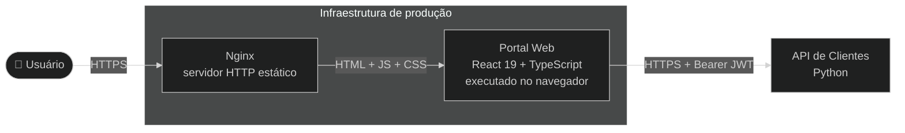

# Arquitetura — Portal Web (frontend-react)

## Visão Geral

O **Portal Web** é uma aplicação de página única (SPA) construída com React 19 e TypeScript, compilada via Vite e servida em produção pelo Nginx. Consome a **API de Clientes** (back-end Python) via HTTPS com autenticação JWT. A estrutura interna segue a metodologia **Feature-Sliced Design (FSD)**, com camadas de dependência estritas verificadas automaticamente pelo ESLint na esteira de CI.

## Diagrama de Contexto

## Diagrama de Containers

## Mapa de Módulos

| Módulo | Responsabilidade | Documentação |
|--------|-----------------|--------------|
| `src/app/` | Camada App do FSD: inicialização da aplicação, providers globais, roteamento e estilos | [README](../../src/app/README.md) |
| `src/app/router/` | Roteamento declarativo com guards de autenticação e carregamento preguiçoso de páginas | [README](../../src/app/router/README.md) |
| `src/shared/api/` | Cliente HTTP com autoinjeção de token Bearer e tratamento centralizado de erro 401 | [README](../../src/shared/api/README.md) |
| `src/shared/auth/` | Infraestrutura de autenticação: armazenamento, análise e monitoramento de token JWT | [README](../../src/shared/auth/README.md) |
| `src/shared/lib/store/` | Gerenciamento de estado Redux com três fatias: auth, ui e session | [README](../../src/shared/lib/store/README.md) |
| `src/mocks/` | Servidor de simulação MSW para testes automatizados e desenvolvimento local | [README](../../src/mocks/README.md) |

## Decisões Arquiteturais (ADRs)

| ID | Decisão | Status |
|----|---------|--------|
| [ADR-001](adrs/ADR-001-plataforma-tecnologica.md) | Tática de plataforma tecnológica | Proposed |
| [ADR-002](adrs/ADR-002-modularizacao.md) | Tática de modularização | Proposed |
| [ADR-003](adrs/ADR-003-gerenciamento-de-estado.md) | Tática de gerenciamento de estado | Proposed |
| [ADR-004](adrs/ADR-004-autenticacao.md) | Tática de autenticação | Proposed |
| [ADR-005](adrs/ADR-005-testes.md) | Tática de testes | Proposed |
| [ADR-006](adrs/ADR-006-conteinizacao.md) | Tática de conteinerização | Proposed |
| [ADR-007](adrs/ADR-007-imposicao-fronteiras-arquiteturais.md) | Tática de imposição de fronteiras arquiteturais | Proposed |
