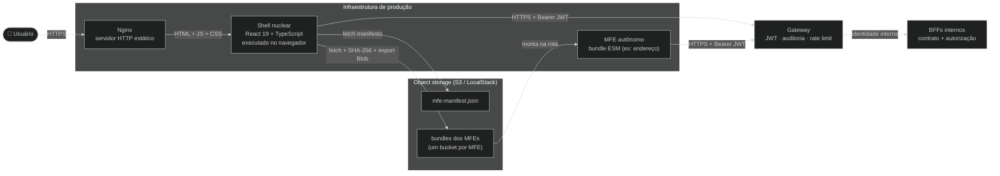

# Arquitetura — Portal Web (frontend-react)

## Visão Geral

O **Portal Web** é uma aplicação de página única (SPA) construída com React 19 e TypeScript, compilada via Vite e servida em produção pelo Nginx. Consome a **API de Clientes** (back-end Python) via HTTPS com autenticação JWT (JSON Web Token). A estrutura interna segue a metodologia **Feature-Sliced Design (FSD)**, com camadas de dependência estritas verificadas automaticamente pelo ESLint na esteira de CI.

## Diagrama de Contexto

## Diagrama de Containers

Os microfrontends são carregados **dinamicamente em runtime** a partir de buckets S3 (Amazon Simple Storage Service), sob o contrato `mount`/`unmount`. A origem e o SHA-256 do bundle são validados antes da execução (ver ADR-008..015 e [`src/app/mfe/`](../../src/app/mfe/README.md)).

O custo de carga dinâmica desse mecanismo é medido e documentado em [`docs/performance/`](../performance/README.md) — relatórios informativos por MFE, decompostos por fase e por perfil de rede.

## Mapa de Módulos

| Módulo | Responsabilidade | Documentação |
|--------|-----------------|--------------|
| `src/app/` | Camada App do FSD: inicialização da aplicação, providers globais, roteamento e estilos | [README](../../src/app/README.md) |
| `src/app/router/` | Roteamento declarativo com guards de autenticação e carregamento preguiçoso de páginas | [README](../../src/app/router/README.md) |
| `src/app/mfe/` | Runtime de microfrontends: manifesto, resolução de dependências, carregamento ESM (ECMAScript Modules — módulos nativos do JavaScript) e montagem isolada | [README](../../src/app/mfe/README.md) |
| `src/app/layout/` | Layout do shell com navegação dinâmica derivada do manifesto de MFEs (microfrontend) | — |
| `src/shared/api/` | Cliente HTTP com autoinjeção de token Bearer e tratamento centralizado de erro 401 | [README](../../src/shared/api/README.md) |
| `src/shared/auth/` | Infraestrutura de autenticação: armazenamento, análise e monitoramento de token JWT | [README](../../src/shared/auth/README.md) |
| `src/shared/lib/store/` | Gerenciamento de estado Redux com três fatias: auth, ui e session | [README](../../src/shared/lib/store/README.md) |
| `src/mocks/` | Servidor de simulação MSW (Mock Service Worker) para testes automatizados e desenvolvimento local | [README](../../src/mocks/README.md) |

## Decisões Arquiteturais (ADRs — Architecture Decision Record, registro de decisão de arquitetura)

| ID | Decisão | Status |
|----|---------|--------|
| [ADR-001](adrs/ADR-001-plataforma-tecnologica.md) | Tática de plataforma tecnológica | Proposed |
| [ADR-002](adrs/ADR-002-modularizacao.md) | Tática de modularização | Proposed |
| [ADR-003](adrs/ADR-003-gerenciamento-de-estado.md) | Tática de gerenciamento de estado | Proposed |
| [ADR-004](adrs/ADR-004-autenticacao.md) | Tática de autenticação | Proposed |
| [ADR-005](adrs/ADR-005-testes.md) | Tática de testes | Proposed |
| [ADR-006](adrs/ADR-006-conteinizacao.md) | Tática de conteinerização | Proposed |
| [ADR-007](adrs/ADR-007-imposicao-fronteiras-arquiteturais.md) | Tática de imposição de fronteiras arquiteturais | Proposed |
| [ADR-008](adrs/ADR-008-microfrontends-dinamicos.md) | Arquitetura de microfrontends dinâmicos | Proposed |
| [ADR-009](adrs/ADR-009-contrato-mount-unmount.md) | Contrato `mount`/`unmount` entre shell e MFEs | Proposed |
| [ADR-010](adrs/ADR-010-manifesto-e-dependencias.md) | Manifesto de MFEs e resolução de dependências | Proposed |
| [ADR-011](adrs/ADR-011-deploy-s3-localstack.md) | Build independente e deploy de MFEs em S3 (LocalStack) | Proposed |
| [ADR-012](adrs/ADR-012-content-security-policy.md) | **Content Security Policy estrito e baseline de segurança** | Proposed |
| [ADR-013](adrs/ADR-013-trusted-types-e-reporting.md) | **Trusted Types e Reporting API** | Proposed |
| [ADR-014](adrs/ADR-014-css-e-contrato-visual-em-microfrontends.md) | **CSS e contrato visual em microfrontends dinâmicos** | Proposed |
| [ADR-015](adrs/ADR-015-gateway-api-e-bff.md) | **Gateway de API com BFFs** | Proposed |
| [ADR-016](adrs/ADR-016-hono-gateway-e-bffs.md) | **Hono como framework web de Gateway e BFFs** | Proposed |
