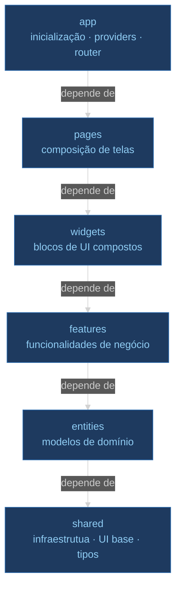

# ADR-002: Tática de modularização

## Contexto e Problema

Aplicações React sem estrutura imposta tendem a organizar o código por tipo técnico (`components/`, `hooks/`, `services/`, `utils/`). Essa abordagem escala mal: à medida que o projeto cresce, uma única funcionalidade fica espalhada por múltiplas pastas, dificultando navegação, isolamento e reuso controlado. O risco de dependências circulares aumenta com o tempo.

O projeto precisava de uma estrutura que mantivesse coesão por domínio, definisse regras claras sobre quem pode depender de quem, e fosse verificável automaticamente — não apenas uma convenção documentada.

**Pergunta-problema:** Como organizar o código da SPA de forma que funcionalidades sejam coesas, as dependências sejam unidirecionais e as regras sejam verificadas automaticamente?

**Referência primária:** https://feature-sliced.design

## Drivers

- **Coesão por funcionalidade**: todo o código relacionado a uma funcionalidade deve estar próximo e ser isolável
- **Dependências unidirecionais**: camadas superiores podem importar de camadas inferiores; o inverso é proibido
- **Verificação automatizada**: as regras não devem depender de disciplina individual (ver ADR-007)
- **Escalabilidade**: a estrutura deve suportar o crescimento do time sem degradação

### Aderência a Princípios

| Princípio | Aderência | Impacto |
|-----------|-----------|---------|
| Separação de responsabilidades | ✅ | Cada camada tem escopo bem definido |
| Baixo acoplamento | ✅ | Dependências unidirecionais eliminam acoplamento circular |
| Alta coesão | ✅ | Código de uma funcionalidade vive junto em `features/` |
| Abertura para extensão | ✅ | Novas funcionalidades adicionam camadas sem alterar existentes |

## Stakeholders (RACI)

- **Deciders (A)**: arquiteto de software do projeto
- **Consulted (C)**: equipe de desenvolvimento front-end
- **Informed (I)**: demais membros do projeto

## Opções Consideradas

### Opção 1: Feature-Sliced Design — FSD (escolhida)

Hierarquia de camadas com dependência unidirecional estrita: `shared → entities → features → widgets → pages → app`. Cada camada importa apenas das camadas abaixo dela.

- ✅ **Prós**: coesão por domínio; dependências explícitas e unidirecionais; padrão com documentação consolidada; verificável via `eslint-plugin-boundaries`
- ❌ **Contras**: curva de aprendizado inicial; requer configuração de lint para imposição (custo único de setup)
- 💰 **Custo**: configuração inicial estimada em 1-2 dias de desenvolvedor; zero custo recorrente

### Opção 2: Organização por tipo técnico

Pastas `components/`, `hooks/`, `services/`, `pages/`, `utils/`.

- ✅ **Prós**: familiar para desenvolvedores com experiência em projetos React menores; zero configuração de lint
- ❌ **Contras**: funcionalidades ficam fragmentadas em múltiplas pastas; sem regras de dependência — acoplamento cresce livremente; não escala além de projetos pequenos

### Opção 3: Não fazer nada (baseline)

Manter arquivos sem estrutura imposta, conforme o projeto for crescendo.

- ✅ **Prós**: zero investimento, zero risco de implementação
- ❌ **Contras**: desestruturação inevitável; onboarding difícil; reuso incontrolado

## Decisão

**Escolhida: Opção 1 — Feature-Sliced Design (FSD)**

### Y-Statement

> **No contexto de** uma SPA React em crescimento com múltiplas funcionalidades,
> **enfrentando** o risco de acoplamento crescente e fragmentação de código por tipo técnico,
> **decidimos por** Feature-Sliced Design com imposição via ESLint,
> **para alcançar** coesão por domínio e dependências unidirecionais verificadas automaticamente,
> **aceitando** a curva de aprendizado inicial e a necessidade de configurar e manter o `eslint.config.ts`.

### Justificativa

FSD é a única metodologia front-end com documentação formal, hierarquia de camadas explícita e suporte a verificação automatizada. A organização por tipo técnico é adequada para projetos pequenos, mas produz dívida técnica previsível em projetos que crescem. A combinação FSD + `eslint-plugin-boundaries` torna a arquitetura uma propriedade verificável do código, não uma intenção documentada.

### Diagrama — Hierarquia de Camadas FSD



A hierarquia é verificada automaticamente em `eslint.config.ts`. Qualquer importação que suba na hierarquia falha o lint:

```typescript
// eslint.config.ts — regras de dependência entre camadas FSD
'boundaries/dependencies': ['error', {
  default: 'disallow',
  rules: [
    { from: { type: 'shared' },   disallow: { to: { type: '*' } } },
    { from: { type: 'entities' }, allow: { to: { type: ['shared'] } } },
    { from: { type: 'features' }, allow: { to: { type: ['entities', 'shared'] } } },
    { from: { type: 'widgets' },  allow: { to: { type: ['features', 'entities', 'shared'] } } },
    { from: { type: 'pages' },    allow: { to: { type: ['widgets', 'features', 'entities', 'shared'] } } },
    { from: { type: 'app' },      allow: { to: { type: ['pages', 'widgets', 'features', 'entities', 'shared'] } } },
  ],
}]
```

## Consequências

### Positivas

- ✅ Onboarding de novos desenvolvedores guiado pela estrutura de pastas
- ✅ Violações de dependência detectadas em tempo de desenvolvimento (IDE + CI)
- ✅ Funcionalidades isoláveis e removíveis sem efeitos colaterais em outras camadas

### Negativas (trade-offs aceitos)

- ❌ Desenvolvedores sem experiência em FSD precisam de introdução inicial
- ❌ Novas funcionalidades exigem decisão sobre qual camada pertence (`feature` vs `widget` vs `page`)

### Neutras (mudanças necessárias)

- 🔄 Todo novo módulo deve ser registrado em `eslint.config.ts` na seção `boundaries/elements`
- 🔄 Camadas vazias (`entities/`, `widgets/`) devem ser preenchidas conforme o projeto cresce — não remover

### Riscos

| Risco | L | I | Mitigação | Owner |
|-------|---|---|-----------|-------|
| Time não entende a hierarquia FSD | M | H | Documentação em `src/app/README.md` + exemplos no onboarding | Arquiteto |
| Módulo registrado na camada errada | M | M | Revisão de código foca em posicionamento FSD | Time |

## Validação

**Como será verificado que a decisão entregou o prometido?**

- [ ] Esteira de CI passa na etapa de lint sem erros de `boundaries/dependencies`
- [ ] Novas funcionalidades são adicionadas em `features/` sem alterar camadas inferiores
- [ ] Nenhuma dependência circular detectada após 3 meses de desenvolvimento

## Links

- ADRs relacionadas: ADR-007 (imposição de fronteiras arquiteturais)
- Documentação do padrão: https://feature-sliced.design

## Revisão

- Revisão futura: 2026-11-24
- Triggers: crescimento do time acima de 5 desenvolvedores front-end, adição de microfrontends, incidente de acoplamento circular

## Histórico

| Versão | Data | Autor | Mudanças |
|--------|------|-------|----------|
| 1.0 | 2026-05-24 | Marco Mendes | Versão inicial |
