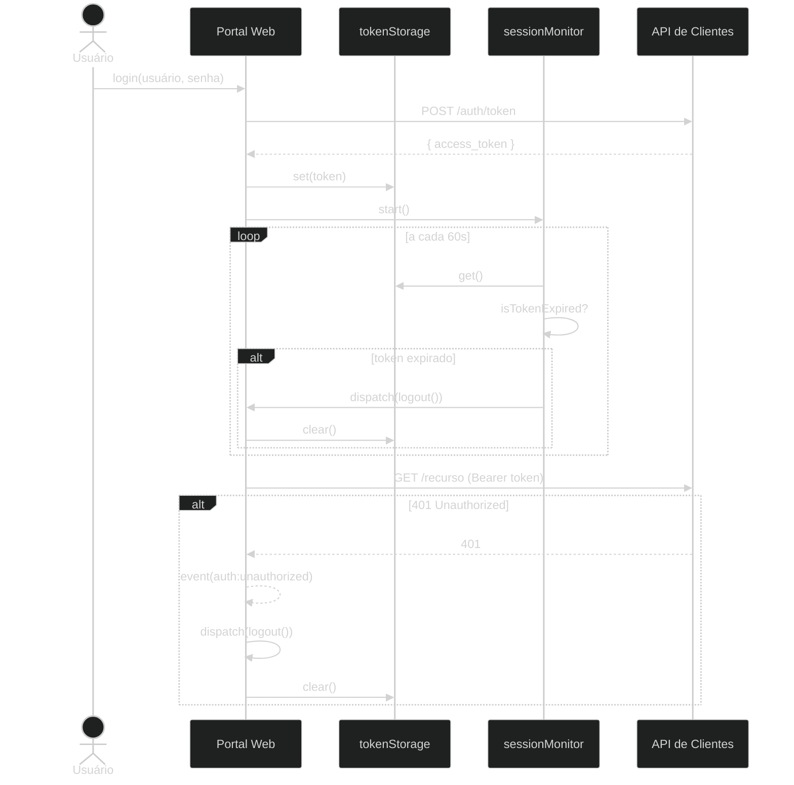

# ADR-004: Tática de autenticação

## Contexto e Problema

O Portal Web utiliza autenticação baseada em JWT emitido pela API de Clientes. O token precisa ser armazenado no navegador entre requisições, ter sua validade verificada proativamente e ser invalidado quando o servidor rejeitar uma requisição por sessão expirada. A escolha do mecanismo de armazenamento impacta diretamente o perfil de segurança da aplicação.

**Pergunta-problema:** Onde e como armazenar o token JWT no navegador de forma que o perfil de segurança seja aceitável sem exigir mudanças no back-end?

**Referência primária:** OWASP Authentication Cheat Sheet — https://cheatsheetseries.owasp.org/cheatsheets/Authentication_Cheat_Sheet.html

## Drivers

- **Segurança**: minimizar a janela de exposição do token a ataques XSS
- **Isolamento de sessão**: cada aba do navegador deve gerenciar sua própria sessão de forma independente
- **Sem dependência de back-end**: a solução não deve exigir alterações no servidor para funcionar
- **Verificação proativa de expiração**: o usuário não deve receber erro de sessão ao tentar uma ação — deve ser informado antes

### Aderência a Princípios

| Princípio | Aderência | Impacto |
|-----------|-----------|---------|
| Defesa em profundidade | ✅ | Armazenamento isolado por aba + monitoramento proativo + tratamento de 401 |
| Privilégio mínimo | ✅ | Token acessível apenas via `tokenStorage` — não exposto globalmente |
| Falha segura | ✅ | Qualquer erro no `parseToken` resulta em token tratado como expirado |

## Stakeholders (RACI)

- **Deciders (A)**: arquiteto de software do projeto
- **Consulted (C)**: equipe de desenvolvimento front-end; responsável pelo back-end da API de Clientes
- **Informed (I)**: demais membros do projeto

## Opções Consideradas

### Opção 1: `sessionStorage` + `sessionMonitor` + evento DOM (escolhida)

Token armazenado em `sessionStorage`. Monitoramento proativo via `setInterval` a cada 60 segundos verifica expiração pelo relógio do cliente. Evento DOM `auth:unauthorized` trata rejeição pelo servidor.

- ✅ **Prós**: isolado por aba (cada aba tem sua sessão independente); limpo automaticamente ao fechar a aba; sem necessidade de mudança no back-end; defesa em profundidade com dois mecanismos de detecção de expiração
- ❌ **Contras**: não persiste entre sessões do navegador (usuário precisa autenticar novamente ao reabrir a aba); relógio do cliente pode estar dessincronizado com o servidor

### Opção 2: `localStorage`

Token armazenado em `localStorage` — persiste entre sessões.

- ✅ **Prós**: persistência entre sessões sem necessidade de nova autenticação
- ❌ **Contras**: acessível por qualquer script na mesma origem — vetor XSS ampliado; persiste mesmo após o usuário "encerrar sessão" em outras abas; incompatível com o princípio de isolamento de sessão

### Opção 3: Cookies `httpOnly`

Token armazenado em cookie `httpOnly` gerenciado pelo back-end.

- ✅ **Prós**: inacessível via JavaScript — melhor perfil de segurança contra XSS; renovação automática possível via cookie de refresh
- ❌ **Contras**: exige mudança no back-end (configuração de CORS com `credentials: include`, emissão de cookie, rota de refresh); fora do escopo desta fase do projeto

### Opção 4: Não fazer nada (baseline)

Armazenar token apenas em memória (`useState`).

- ✅ **Prós**: sem vetor XSS de armazenamento
- ❌ **Contras**: token perdido em qualquer recarga de página; usuário precisa autenticar a cada navegação — inaceitável para produção

## Decisão

**Escolhida: Opção 1 — `sessionStorage` + `sessionMonitor` + evento DOM**

### Y-Statement

> **No contexto de** autenticação JWT em uma SPA sem mudanças no back-end,
> **enfrentando** o trade-off entre segurança de armazenamento e usabilidade sem persistência via cookie httpOnly,
> **decidimos por** `sessionStorage` com monitoramento proativo de expiração,
> **para alcançar** isolamento por aba e detecção dupla de sessão expirada,
> **aceitando** que o usuário precisará autenticar novamente ao reabrir a aba do navegador.

### Justificativa

Cookies `httpOnly` são a solução mais segura, mas exigem alterações no back-end que estão fora do escopo atual. `localStorage` tem perfil de segurança inferior por persistir além da sessão. `sessionStorage` oferece o melhor equilíbrio disponível: isolamento por aba, limpeza automática e zero dependência de back-end. A combinação com `sessionMonitor` e o evento `auth:unauthorized` cria dois mecanismos independentes de detecção de expiração — por relógio do cliente e por resposta do servidor.

### Diagrama — Fluxo de Autenticação



O armazenamento usa `sessionStorage` com interface explícita para isolar o acesso ao token (`src/shared/auth/tokenStorage.ts`):

```typescript
const KEY = 'portal_access_token'

export const tokenStorage = {
  get(): string | null { return sessionStorage.getItem(KEY) },
  set(token: string): void { sessionStorage.setItem(KEY, token) },
  clear(): void { sessionStorage.removeItem(KEY) },
}
```

O `sessionMonitor` combina dois mecanismos de detecção (`src/shared/auth/sessionMonitor.ts`):

```typescript
// mecanismo 1: verificação proativa a cada 60s pelo relógio do cliente
intervalId = setInterval(() => {
  const token = tokenStorage.get()
  if (token && isTokenExpired(token)) store.dispatch(logout())
}, 60_000)

// mecanismo 2: reação à rejeição do servidor via evento DOM
window.addEventListener('auth:unauthorized', handleUnauthorized)
```

## Consequências

### Positivas

- ✅ Sessões isoladas por aba — múltiplos usuários podem estar autenticados simultaneamente em abas diferentes
- ✅ Token limpo automaticamente ao fechar a aba — sem necessidade de logout explícito em sessões esquecidas
- ✅ Dois mecanismos independentes de detecção de expiração reduzem a janela de sessão inválida não percebida

### Negativas (trade-offs aceitos)

- ❌ Usuário perde a sessão ao reabrir a aba — necessidade de nova autenticação
- ❌ Relógio do cliente pode estar dessincronizado com o servidor — `sessionMonitor` pode não detectar expiração no momento exato

### Neutras (mudanças necessárias)

- 🔄 Toda requisição HTTP deve passar pelo `httpClient` — que injeta o token automaticamente (ver `src/shared/api/httpClient.ts`)
- 🔄 Toda ação de logout (incluindo por expiração) deve passar por `store.dispatch(logout())` — que chama `tokenStorage.clear()`

### Riscos

| Risco | L | I | Mitigação | Owner |
|-------|---|---|-----------|-------|
| XSS injeta script que lê `sessionStorage` | L | H | Política de Content Security Policy (CSP) no Nginx; sanitização de entradas | Segurança |
| Dessincronização de relógio causa logout prematuro | L | M | Intervalo de 60s oferece tolerância razoável; ajustável em `sessionMonitor.ts` | Time |

## Validação

**Como será verificado que a decisão entregou o prometido?**

- [ ] Teste de ponta a ponta confirma redirecionamento para login após expiração do token
- [ ] Abrir a aplicação em nova aba com sessão fechada redireciona para login (não herda sessão)
- [ ] Resposta 401 da API resulta em logout e redirecionamento (coberto por teste em `tests/e2e/auth/`)

## Links

- ADRs relacionadas: ADR-001 (plataforma), ADR-003 (gerenciamento de estado)
- Implementação: `src/shared/auth/`, `src/shared/api/httpClient.ts`
- Referência: OWASP Authentication Cheat Sheet — https://cheatsheetseries.owasp.org/cheatsheets/Authentication_Cheat_Sheet.html

## Revisão

- Revisão inicial: 2026-11-24
- Triggers: migração para cookies `httpOnly` no back-end, incidente de segurança relacionado a XSS, mudança no provedor de identidade

## Histórico

| Versão | Data | Autor | Mudanças |
|--------|------|-------|----------|
| 1.0 | 2026-05-24 | Marco Mendes | Versão inicial |
