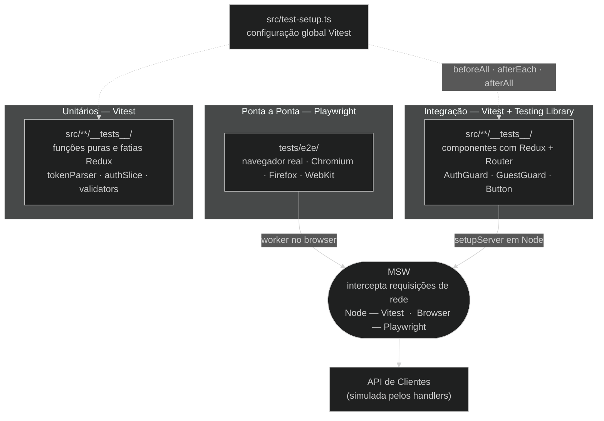

# ADR-005: Tática de testes

## Contexto

O projeto necessita de uma estratégia de testes que cubra três níveis: unitário/integração (lógica isolada e componentes), ponta a ponta (fluxos completos no navegador) e simulação de API (para desacoplar testes do back-end real). A escolha de Vite como ferramenta de compilação (ADR-001) limita a compatibilidade com Jest sem configuração extra de transpilação.

**Referências:** https://vitest.dev · https://playwright.dev · https://mswjs.io

## Decisão

Adotar **Vitest + Playwright + MSW** como conjunto de testes:

- **Vitest**: testes unitários e de integração, executados no mesmo processo do Vite
- **Playwright**: testes de ponta a ponta em navegadores reais
- **MSW (Mock Service Worker)**: interceptação de rede para simular a API de Clientes

## Opções avaliadas

### Opção 1: Vitest + Playwright + MSW (escolhida)
- **Prós**: Vitest roda sem transpilação extra (suporte nativo a ESM e TypeScript); Playwright oferece cobertura multinavegador real; MSW intercepta na camada de rede — os testes exercitam o mesmo código de produção com respostas controladas
- **Contras**: três ferramentas distintas para aprender; Playwright exige instalação de binários de navegadores

### Opção 2: Jest + Cypress + MSW
- **Prós**: Jest é amplamente conhecido; Cypress combina testes de componente e ponta a ponta
- **Contras**: Jest exige configuração adicional de transpilação para projetos Vite/ESM; Cypress é mais pesado e lento que Playwright em CI

### Opção 3: Não fazer nada (baseline)
- **Prós**: zero esforço inicial
- **Contras**: sem rede de segurança para regressões; inaceitável para um produto em produção

## Diagrama — Níveis e Ferramentas de Teste



O MSW é inicializado globalmente para todos os testes Vitest em `src/test-setup.ts`:

```typescript
import { beforeAll, afterEach, afterAll } from 'vitest'
import { server } from './mocks/server'

beforeAll(() => server.listen({ onUnhandledRequest: 'warn' }))
afterEach(() => server.resetHandlers())   // isola handlers entre testes
afterAll(() => server.close())
```

**Teste unitário** — lógica pura sem dependências de framework (`src/shared/auth/__tests__/tokenParser.test.ts`):

```typescript
describe('isTokenExpired', () => {
  it('retorna false para token válido', () => {
    expect(isTokenExpired(VALID_TOKEN)).toBe(false)
  })
  it('retorna true para token expirado', () => {
    expect(isTokenExpired(EXPIRED_TOKEN)).toBe(true)
  })
  it('retorna true para token mal-formado', () => {
    expect(isTokenExpired('invalido')).toBe(true)
  })
})
```

**Teste de integração** — componente renderizado com Redux real (`src/app/router/guards/__tests__/AuthGuard.test.tsx`):

```typescript
describe('AuthGuard', () => {
  it('renderiza rota protegida quando autenticado', () => {
    renderAuthGuard(true)
    expect(screen.getByText('Área restrita')).toBeInTheDocument()
  })
  it('redireciona para /login quando não autenticado', () => {
    renderAuthGuard(false)
    expect(screen.getByText('Tela de login')).toBeInTheDocument()
    expect(screen.queryByText('Área restrita')).not.toBeInTheDocument()
  })
})
```

## Consequências

- A esteira de CI executa `vitest run --coverage` e `playwright test` em cada pull request
- MSW deve ser mantido atualizado com os contratos da API de Clientes — desatualização leva a falsos positivos nos testes
- Arquivos de simulação ficam em `src/mocks/` e são carregados condicionalmente apenas em modo de desenvolvimento e testes (ver `src/main.tsx`)
