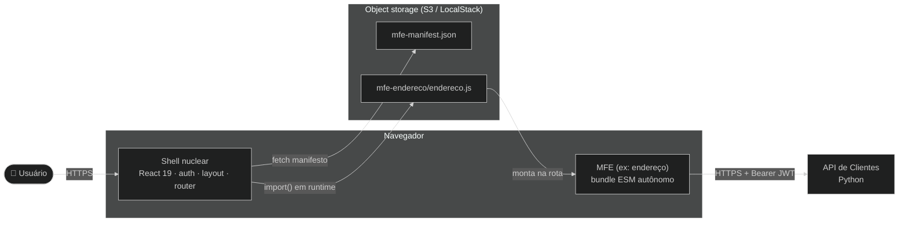

# ADR-008: Arquitetura de microfrontends dinâmicos

## Contexto e Problema

O Portal Web nasceu como uma SPA (Single-Page Application) monolítica (ADR-001/002). Conforme o produto cresce, múltiplas equipes precisam entregar funcionalidades de forma independente — sem que um deploy de uma área quebre ou bloqueie as demais, e sem recompilar o portal inteiro a cada mudança de um módulo de negócio.

A pergunta não é "como dividir o código em pastas" (isso é FSD (Feature-Sliced Design), ADR-002), mas "como permitir que unidades de funcionalidade sejam **construídas, versionadas e implantadas de forma autônoma** e carregadas pelo portal **em tempo de execução**, sem acoplamento de build".

**Pergunta-problema:** Como transformar o portal em uma plataforma capaz de carregar funcionalidades autônomas (microfrontends) em runtime, isolando falhas e mantendo o shell estável?

## Drivers

- **Autonomia de entrega**: cada MFE constrói e deploya sem coordenar com o shell ou outros MFEs
- **Shell estável ("nuclear")**: o núcleo do portal (auth, layout, roteamento, manifesto) muda pouco; funcionalidades entram/saem sem tocá-lo
- **Isolamento de falha**: um MFE que quebra (bundle ausente, erro de runtime) não pode derrubar o portal
- **Carregamento sob demanda**: o bundle de um MFE só é baixado quando o usuário acessa sua rota
- **Comunicação só com o back-end**: MFEs não se comunicam entre si no front; falam com a API. Reduz acoplamento.

### Aderência a Princípios

| Princípio | Aderência | Impacto |
|-----------|-----------|---------|
| Separação de responsabilidades | ✅ | Shell orquestra; MFE entrega funcionalidade |
| Baixo acoplamento | ✅ | MFEs não dependem uns dos outros; só do contrato e da API |
| Isolamento de falha | ✅ | Error boundary contém erros por MFE |
| Abertura para extensão | ✅ | Novo MFE = nova entrada no manifesto, zero alteração no shell |

## Stakeholders (RACI)

- **Deciders (A)**: arquiteto de software do projeto
- **Consulted (C)**: equipes de funcionalidades (donas dos MFEs), plataforma
- **Informed (I)**: demais membros do projeto

## Opções Consideradas

### Opção 1: Shell nuclear + MFEs autônomos carregados em runtime de S3 (Amazon Simple Storage Service) (escolhida)

O shell carrega um `mfe-manifest.json`, valida-o, resolve a ordem de dependências e renderiza rotas dinâmicas. Cada rota monta um MFE via `import()` ESM (ECMAScript Modules — módulos nativos do JavaScript) de um bundle hospedado em bucket S3, sob o contrato `mount`/`unmount` (ADR-009). Cada MFE empacota o próprio React e fala apenas com o back-end.

- ✅ **Prós**: deploy/versão independentes; isolamento de falha; carga sob demanda; shell estável
- ❌ **Contras**: cada MFE empacota seu React (bundles maiores); contrato precisa ser versionado e respeitado
- 💰 **Custo**: runtime de carga e validação no shell (custo único); disciplina de contrato (recorrente)

### Opção 2: Monólito modular (status quo — baseline)

Manter tudo no mesmo build; "módulos" são apenas pastas FSD.

- ✅ **Prós**: simplicidade; um único bundle otimizado; sem contrato de runtime
- ❌ **Contras**: deploy acoplado (qualquer mudança recompila tudo); equipes coordenam releases; não escala em organização

### Opção 3: Build-time integration (monorepo com libs publicadas)

Cada funcionalidade é um pacote npm consumido pelo shell em build time.

- ✅ **Prós**: tipos compartilhados; um bundle final coeso
- ❌ **Contras**: deploy ainda é acoplado (o shell recompila ao subir versão de lib); não há autonomia real de implantação

## Decisão

**Escolhida: Opção 1 — shell nuclear + MFEs autônomos carregados em runtime.**

### Y-Statement

> **No contexto de** um portal que precisa escalar para múltiplas equipes entregando funcionalidades de forma independente,
> **enfrentando** o acoplamento de build de um monólito que recompila a cada mudança,
> **decidimos por** um shell nuclear que carrega MFEs autônomos de buckets S3 em runtime, sob um contrato `mount`/`unmount`,
> **para alcançar** deploy independente, isolamento de falha e carga sob demanda,
> **aceitando** bundles maiores (React embutido por MFE) e a disciplina de manter um contrato versionado.

### Justificativa

A autonomia de implantação só é real quando o shell **não recompila** ao adicionar/atualizar um MFE. Isso exige integração em runtime, não em build time (descarta Opção 3) e supera o monólito (Opção 2). O isolamento de falha via error boundary garante que o portal sobreviva a um MFE indisponível.

### Diagrama — Containers com microfrontends

## Consequências

### Positivas

- ✅ Equipes entregam funcionalidades sem recompilar ou redeployar o shell
- ✅ Falha de um MFE fica contida; o portal e os demais módulos seguem funcionando
- ✅ Bundle de um MFE só é baixado quando sua rota é acessada

### Negativas (trade-offs aceitos)

- ❌ Cada MFE empacota seu próprio React → bundles maiores (preço da autonomia — ver ADR-009)
- ❌ Necessidade de um contrato estável e versionado entre shell e MFEs

### Neutras (mudanças necessárias)

- 🔄 Novo runtime de MFE na camada `app` (`src/app/mfe/`)
- 🔄 Manifesto (`public/mfe-manifest.json`) passa a ser fonte da navegação dinâmica

### Riscos

| Risco | L | I | Mitigação | Owner |
|-------|---|---|-----------|-------|
| MFE quebra o shell | M | H | Error boundary por MFE (`MfeErrorBoundary`) | Plataforma |
| Drift de contrato entre shell e MFE | M | M | Contrato versionado + validação no carregador (ADR-009) | Arquiteto |
| Bundle indisponível no storage | M | M | Estado de falha isolado + estados no manifesto (`maintenance`/`disabled`) | Plataforma |

## Validação

- [ ] Adicionar um MFE não altera o código do shell nem de outros MFEs
- [ ] E2E (end-to-end) comprova que o portal sobrevive a um MFE que falha ao carregar
- [ ] Bundle de MFE é carregado apenas ao acessar sua rota

## Links

- Código: [`src/app/mfe/`](../../../src/app/mfe/README.md), [`public/mfe-manifest.json`](../../../public/mfe-manifest.json)
- ADRs relacionadas: ADR-002 (modularização), ADR-009 (contrato mount/unmount), ADR-010 (manifesto e dependências), ADR-011 (deploy S3)

## Revisão

- Revisão futura: 2026-12-04
- Triggers: terceiro MFE em produção, necessidade de comunicação entre MFEs, migração de topologia de repositório

## Histórico

| Versão | Data | Autor | Mudanças |
|--------|------|-------|----------|
| 1.0 | 2026-06-04 | Marco Mendes | Versão inicial |
