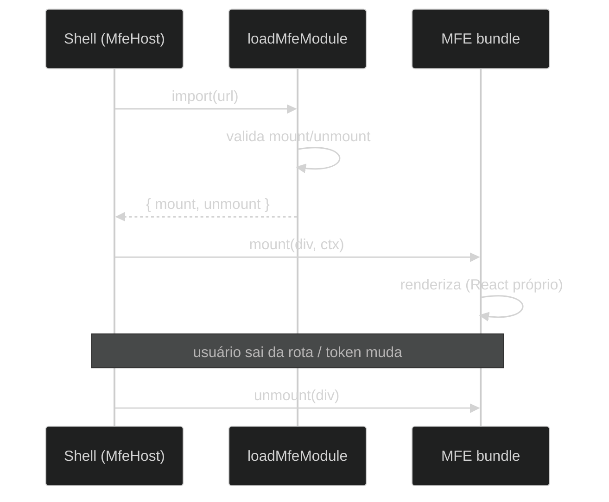

# ADR-009: Contrato `mount`/`unmount` entre shell e MFEs

## Contexto e Problema

A ADR-008 decidiu por integração de microfrontends em **runtime**. Falta definir o **mecanismo** dessa integração: como um bundle independente, construído por outra equipe, é montado dentro do shell e como recebe o que precisa do contexto (URL da API, token de sessão) sem importar nada do shell em build time.

A escolha do mecanismo é a decisão arquitetural mais consequente da plataforma: define o acoplamento entre shell e MFEs, o tamanho dos bundles e a estratégia de versionamento de dependências.

**Pergunta-problema:** Qual mecanismo de integração runtime usar entre o shell e os MFEs, mantendo cada MFE autônomo (sem dependências compartilhadas entre si)?

## Drivers

- **Autonomia real**: um MFE não pode depender da versão de React (ou de qualquer lib) de outro MFE ou do shell
- **Contrato mínimo e estável**: a interface entre shell e MFE deve ser pequena, explícita e versionável
- **Ciclo de vida claro**: montar ao entrar na rota, desmontar ao sair, remontar quando a sessão muda
- **Tecnologia-agnóstico (na medida do possível)**: o contrato não deve presumir que o MFE use React

### Aderência a Princípios

| Princípio | Aderência | Impacto |
|-----------|-----------|---------|
| Baixo acoplamento | ✅ | Contrato de duas funções; nenhuma dependência de build compartilhada |
| Interface segregada | ✅ | `MfeMountContext` expõe só o necessário (apiUrl, token, basePath, onUnauthorized) |
| Substituibilidade | ✅ | Qualquer bundle que honre o contrato funciona, independente do framework interno |

## Stakeholders (RACI)

- **Deciders (A)**: arquiteto de software
- **Consulted (C)**: equipes donas dos MFEs
- **Informed (I)**: time de plataforma

## Opções Consideradas

### Opção 1: Contrato `mount`/`unmount` via Vite lib mode + `import()` ESM nativo (escolhida)

Cada MFE é buildado em Vite **lib mode** como um módulo ESM único que exporta duas funções:

```ts
export interface MfeMountContext {
  apiUrl: string
  token: string | null
  onUnauthorized: () => void
  basePath: string
}
export interface MfeModule {
  mount: (el: HTMLElement, ctx: MfeMountContext) => void
  unmount: (el: HTMLElement) => void
}
```

O shell faz `import(url)` nativo do bundle, valida que `mount`/`unmount` existem e chama `mount(div, ctx)`. React (ou qualquer framework) vai **embutido** no bundle do MFE.

- ✅ **Prós**: autonomia total (sem deps compartilhadas); contrato mínimo; usa recurso nativo da plataforma (`import()` ESM); agnóstico de framework
- ❌ **Contras**: cada MFE empacota o próprio React → bundles maiores e duplicação de runtime entre MFEs
- 💰 **Custo**: tamanho de bundle (recorrente, aceito); manutenção do tipo de contrato (baixo)

### Opção 2: Module Federation (`@originjs/vite-plugin-federation`)

Compartilhamento de dependências em runtime, com React como *singleton* federado.

- ✅ **Prós**: bundles menores (React compartilhado); ecossistema conhecido
- ❌ **Contras**: **o valor central do Module Federation — compartilhar deps — contraria o requisito "MFE autônomo, sem deps entre si"**; acopla versões de React entre shell e MFEs (singleton exige compatibilidade); adiciona um runtime de federação e complexidade de configuração
- **Por que foi descartado**: a plataforma escolheu autonomia sobre tamanho de bundle. Federation otimiza exatamente a dimensão que decidimos não priorizar, ao custo de reintroduzir o acoplamento de versões que queremos evitar.

### Opção 3: Web Components + Shadow DOM

Cada MFE registra um custom element; o shell o instancia.

- ✅ **Prós**: isolamento de estilo via Shadow DOM; padrão de plataforma
- ❌ **Contras**: passar contexto rico (funções como `onUnauthorized`) por atributos/propriedades é desajeitado; Shadow DOM complica integração de estilos globais e ferramentas; ganho de isolamento não justifica o atrito para este projeto

## Decisão

**Escolhida: Opção 1 — contrato `mount`/`unmount` via Vite lib mode + `import()` ESM nativo.**

### Y-Statement

> **No contexto de** integração runtime de MFEs construídos por equipes independentes,
> **enfrentando** o risco de acoplar versões de dependências entre módulos,
> **decidimos por** um contrato `mount`/`unmount` com bundles ESM autônomos (React embutido), carregados por `import()` nativo,
> **para alcançar** autonomia total de build e um contrato mínimo e estável,
> **aceitando** bundles maiores pela duplicação de React entre MFEs e descartando o compartilhamento de deps do Module Federation.

### Justificativa

O requisito "MFE autônomo, sem dependências entre si" é incompatível com o propósito do Module Federation (compartilhar deps). Escolher Federation seria adotar uma ferramenta cujo principal benefício contradiz nossa restrição central, pagando em acoplamento de versões. O contrato `mount`/`unmount` é a expressão mais simples de integração runtime: duas funções, um objeto de contexto, e nenhuma suposição sobre o framework interno do MFE.

### Contrato formal e ciclo de vida

- **`mount(el, ctx)`**: o MFE assume o `el` (uma `<div>` provida pelo shell) e renderiza dentro dele, usando `ctx.apiUrl`/`ctx.token` para falar com o back-end e `ctx.onUnauthorized()` para sinalizar sessão expirada.
- **`unmount(el)`**: o MFE libera o `el` (desmonta sua árvore, remove listeners).
- **Regras de validação** (no carregador): o módulo importado **deve** expor `mount` e `unmount` como funções; caso contrário, o carregamento falha de forma explícita e o erro é isolado pelo error boundary.
- **Ciclo de vida**: `mount` ao entrar na rota; `unmount` ao sair; **remontagem** quando a URL do bundle ou o token mudam (snapshot de sessão injetado no `mount`).



### Trade-off aceito

Cada MFE empacota o próprio React. O bundle de exemplo (`endereco.js`) tem ~800 kB não comprimido (~200 kB gzip) por causa disso. É o **preço da autonomia** e foi aceito conscientemente — a alternativa (Federation) reintroduziria o acoplamento de versões que a plataforma decidiu evitar.

## Consequências

### Positivas

- ✅ MFEs evoluem suas dependências sem coordenar com o shell ou entre si
- ✅ Contrato pequeno e explícito, fácil de validar e versionar
- ✅ `import()` nativo: sem runtime de federação proprietário

### Negativas (trade-offs aceitos)

- ❌ Duplicação de React entre MFEs → bundles maiores
- ❌ Sem compartilhamento de estado de UI entre MFEs (intencional: comunicação só via back-end)

### Neutras

- 🔄 O contrato vive em `src/app/mfe/types.ts` (shell) e é **copiado** localmente em cada MFE (`mfes/<id>/src/contract.ts`) para preservar a autonomia

### Riscos

| Risco | L | I | Mitigação | Owner |
|-------|---|---|-----------|-------|
| MFE não honra o contrato | M | H | Validação explícita em `loadMfeModule` (falha clara) | Plataforma |
| Cópia local do contrato diverge do shell | M | M | Contrato versionado (`schemaVersion`); revisão ao mudar a interface | Arquiteto |

## Validação

- [ ] Carregador rejeita bundle sem `mount`/`unmount` com erro explícito
- [ ] MFE monta na rota e desmonta ao sair (sem vazamento)
- [ ] Bundle do MFE funciona no browser sem deps do shell

## Links

- Código: [`src/app/mfe/types.ts`](../../../src/app/mfe/types.ts), [`src/app/mfe/loadMfeModule.ts`](../../../src/app/mfe/loadMfeModule.ts), [`src/app/mfe/MfeHost.tsx`](../../../src/app/mfe/MfeHost.tsx), [`mfes/endereco/src/index.tsx`](../../../mfes/endereco/src/index.tsx)
- ADRs relacionadas: ADR-008 (arquitetura de MFEs), ADR-010 (manifesto), ADR-011 (deploy/topologia)

## Revisão

- Revisão futura: 2026-12-04
- Triggers: necessidade de compartilhar deps (reavaliar Federation), adoção de framework não-React em algum MFE

## Histórico

| Versão | Data | Autor | Mudanças |
|--------|------|-------|----------|
| 1.0 | 2026-06-04 | Marco Mendes | Versão inicial |
