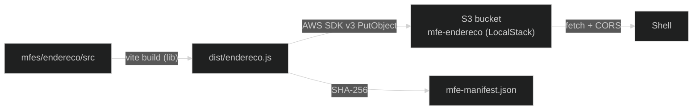

# ADR-011: Build independente e deploy de MFEs em S3 (LocalStack) e topologia de repositório

## Contexto e Problema

A ADR-008/009 decidiram que cada MFE é um bundle ESM (ECMAScript Modules — módulos nativos do JavaScript) autônomo carregado em runtime. Falta definir **como** esse bundle é construído de forma independente, **onde** é hospedado e por **qual** processo é publicado — e, criticamente, **qual a topologia de repositório** que sustenta a autonomia de entrega.

**Pergunta-problema:** Como construir, hospedar e publicar cada MFE de forma independente, e qual topologia de repositório adotar para microfrontends?

## Drivers

- **Build independente**: cada MFE compila sem depender do build do shell ou de outros MFEs
- **Hospedagem estática**: o bundle precisa estar acessível por URL pública para o `import()` do shell
- **Deploy autônomo**: publicar um MFE não envolve o pipeline do shell
- **Ambiente local fiel**: simular S3 (Amazon Simple Storage Service) localmente para desenvolvimento e E2E (end-to-end)

### Aderência a Princípios

| Princípio | Aderência | Impacto |
|-----------|-----------|---------|
| Autonomia de entrega | ✅ | Build e deploy por MFE, isolados |
| Paridade dev/prod | ✅ | LocalStack simula S3 fielmente |
| Infra como código | ✅ | `docker-compose.yml` + script de deploy versionados |

## Stakeholders (RACI)

- **Deciders (A)**: arquiteto de software
- **Consulted (C)**: plataforma, DevOps
- **Informed (I)**: equipes donas dos MFEs

## Opções Consideradas

### Build e hospedagem

#### Opção 1: Vite lib mode → bucket S3 por MFE, via AWS SDK v3 (escolhida)

Cada MFE roda `vite build` em **lib mode** (ESM único), e um script publica `dist/<id>.js` em um bucket S3 dedicado. Em dev, **LocalStack** provê o S3 em `:4566`. O deploy usa o **AWS SDK for JavaScript v3** (cria bucket, faz upload e define policy pública de leitura e CORS — Cross-Origin Resource Sharing).

- ✅ **Prós**: hospedagem estática barata e escalável; um bucket por MFE reforça o isolamento; AWS SDK e LocalStack são padrão de mercado; CORS configurável para o `import()` cross-origin
- ❌ **Contras**: exige configurar policy/CORS por bucket; CDN (Content Delivery Network)/cache fica fora do escopo desta POC (proof of concept — prova de conceito)
- 💰 **Custo**: script de deploy por MFE (custo único); infra LocalStack local (zero custo de nuvem)

#### Opção 2: Servir os bundles pelo próprio shell (mesma origem)

- ✅ **Prós**: sem CORS; um deploy só
- ❌ **Contras**: reacopla o deploy do MFE ao do shell — contraria a autonomia

### Topologia de repositório

#### Opção A: Repositório isolado por MFE (recomendado para produção)

Cada MFE em seu próprio repositório, com CI/CD próprio, `CODEOWNERS` e branch protection.

- ✅ **Prós**: isolamento real de escrita, pipeline e propriedade; autonomia de equipe completa
- ❌ **Contras**: mais infraestrutura de repositórios para criar/manter

#### Opção B: Repositório único com pasta por MFE (adotado nesta POC — limitação didática)

`mfes/<id>/` dentro do repo do shell; cada pasta com `package.json`, build e deploy próprios.

- ✅ **Prós**: simplifica o estudo; build/deploy ainda independentes por pasta
- ❌ **Contras**: **não** demonstra isolamento de *repositório* (escrita restrita, CI/CD próprio, CODEOWNERS)

## Decisão

**Escolhida: Vite lib mode + bucket S3 por MFE (LocalStack em dev) via AWS SDK v3.** Para topologia, **Opção B (repo único com `mfes/<id>/`) como limitação didática desta POC**, com **recomendação explícita de Opção A (repositório isolado por MFE) para produção**.

### Y-Statement

> **No contexto de** MFEs autônomos que precisam ser construídos e publicados independentemente,
> **enfrentando** o risco de reacoplar deploy de MFE ao do shell,
> **decidimos por** build em Vite lib mode com hospedagem em bucket S3 por MFE (LocalStack em dev) via AWS SDK v3, em um repo único com pasta por MFE **para fins didáticos**,
> **para alcançar** independência de build/deploy com ambiente local fiel,
> **aceitando** que a topologia de repo único **não** demonstra o isolamento de repositório — que **recomendamos para produção**.

### Justificativa

A independência de **build e deploy** — o que de fato sustenta a arquitetura de MFEs — é preservada na Opção B: cada pasta tem seu `package.json`, build e script de deploy. O que a Opção B **não** demonstra é o isolamento de **repositório** (controle de escrita, pipeline e propriedade por equipe). Para uma POC de estudo, o repo único reduz atrito sem comprometer o aprendizado do mecanismo central. **Em produção, microfrontends pedem repositório isolado por MFE.**

O download cross-origin do bundle (shell em uma origem, bucket em `:4566`) exige `Access-Control-Allow-Origin` no bucket — configurado no script de deploy.

### Atualização 1.1 — publicação vinculada ao hash do manifesto

O deploy orquestrado da raiz (`npm run deploy`) calcula SHA-256 do arquivo gerado
em `dist/`, publica o bundle, confirma HTTP 200 no bucket e atualiza o campo
`integrity` da entrada correspondente em `public/mfe-manifest.json`. Assim, o
manifesto acompanha o artefato efetivamente publicado. Pipelines de produção
devem executar a mesma etapa de forma atômica: bundle e manifesto precisam ser
promovidos juntos.

### Diagrama — pipeline de deploy

## Consequências

### Positivas

- ✅ Cada MFE compila e publica sozinho
- ✅ Ambiente local fiel ao S3 (LocalStack) para dev e E2E
- ✅ Bucket por MFE reforça isolamento e permite política de acesso por módulo

### Negativas (trade-offs aceitos)

- ❌ Repo único nesta POC não demonstra isolamento de repositório
- ❌ Configuração de policy/CORS por bucket

### Neutras

- 🔄 CDN, versionamento de bundle e cache-busting ficam para evolução futura
- 🔄 Em produção: migrar para repositório isolado por MFE com CI/CD próprio

### Riscos

| Risco | L | I | Mitigação | Owner |
|-------|---|---|-----------|-------|
| Falta de CORS quebra o `import()` | M | H | CORS configurado no deploy; verificado no E2E | Plataforma |
| Repo único cria acoplamento informal entre MFEs | M | M | Disciplina de pastas; migração para multi-repo em produção | Arquiteto |
| Manifesto aponta para hash desatualizado | M | H | Deploy orquestrado recalcula `integrity` após validar o upload | Plataforma |

## Validação

- [ ] `npm run build` em `mfes/<id>/` gera ESM único
- [ ] `npm run deploy` publica no bucket e o bundle responde 200 com CORS
- [ ] Shell carrega o bundle cross-origin via `import()`
- [ ] Hash publicado no manifesto confere com os bytes do bundle no bucket

## Links

- Código: [`mfes/endereco/vite.config.ts`](../../../mfes/endereco/vite.config.ts), [`mfes/endereco/scripts/deploy.ts`](../../../mfes/endereco/scripts/deploy.ts), [`infra/docker-compose.yml`](../../../infra/docker-compose.yml)
- ADRs relacionadas: ADR-008 (arquitetura), ADR-009 (contrato), ADR-006 (conteinerização)

## Revisão

- Revisão futura: 2026-12-04
- Triggers: ida para produção (migrar topologia de repositório), introdução de CDN/cache-busting

## Histórico

| Versão | Data | Autor | Mudanças |
|--------|------|-------|----------|
| 1.0 | 2026-06-04 | Marco Mendes | Versão inicial |
| 1.1 | 2026-07-11 | Codex | Atualização automatizada de `integrity` no deploy orquestrado |
