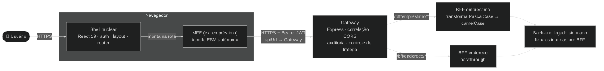

# ADR-015: Gateway de API com BFFs

## Contexto e Problema

Desde a ADR-008, cada MFE "se comunica apenas com o back-end, nunca com outros MFEs", via `apiUrl`. Isso significa que, hoje, cada MFE fala diretamente com o formato do back-end legado — no caso do MFE de empréstimo, um contrato `.svc` em PascalCase que "espelha o payload do servidor" (ver `mfes/emprestimo/src/dto/index.ts`). Não há, em lugar nenhum da plataforma, um ponto único onde se possa auditar o tráfego entre os MFEs e o back-end, nem aplicar controle de taxa de requisições — cada MFE fala diretamente com a rede externa.

**Pergunta-problema:** Como introduzir um ponto único de borda entre os MFEs e o back-end, capaz de auditar tráfego e aplicar controle de taxa, sem obrigar cada MFE a conhecer o formato bruto do back-end legado?

## Drivers

- **Desacoplamento de contrato**: MFEs não deveriam conhecer o formato legado (`.svc`, PascalCase) do back-end — cada um deveria falar um contrato pensado para si.
- **Visibilidade de tráfego**: nenhum componente da plataforma hoje audita quem chamou o quê, quando, com que status e duração.
- **Proteção contra sobrecarga**: nenhum componente aplica limite de requisições — um MFE com bug (loop de chamadas, por exemplo) pode saturar o back-end sem controle algum.
- **Extensibilidade**: novos MFEs devem poder ganhar seu próprio adaptador de contrato sem alterar os já existentes.

### Aderência a Princípios

| Princípio | Aderência | Impacto |
|-----------|-----------|---------|
| Separação de responsabilidades | ✅ | Gateway cuida de borda (auditoria/tráfego); BFF cuida de contrato por MFE |
| Baixo acoplamento | ✅ | MFE não conhece mais o formato do back-end legado, só o contrato do seu BFF |
| Abertura para extensão | ✅ | Novo MFE = novo BFF + nova entrada de roteamento no Gateway |
| Ponto único de falha | ⚠️ | Gateway e BFFs são novos componentes na cadeia — ver Riscos |

## Stakeholders (RACI)

- **Deciders (A)**: arquiteto de software do projeto
- **Consulted (C)**: equipes de funcionalidades (donas dos MFEs), plataforma
- **Informed (I)**: demais membros do projeto

## Opções Consideradas

### Opção 1: Gateway (auditoria + controle de tráfego) + um BFF por MFE (transformação de mensagem) — escolhida

Um Gateway único recebe toda requisição dos MFEs, aplica correlação, controle de tráfego e auditoria, e roteia por prefixo de path (`/bff/<nome>`) para o BFF do MFE correspondente. Cada BFF adapta o contrato do seu MFE — no caso do empréstimo, transformando o payload legado em PascalCase para um contrato limpo em camelCase; no caso do endereço, atuando como passthrough (o contrato já é limpo).

- ✅ **Prós**: cada responsabilidade (borda vs. contrato) tem um dono único; controle de tráfego e auditoria não se duplicam por BFF; extensível a novos MFEs
- ❌ **Contras**: dois tipos de serviço novos para operar (Gateway, BFF); um hop de rede a mais por requisição
- 💰 **Custo**: implementação e manutenção de 3 serviços novos (recorrente); refactor do MFE de empréstimo para o novo contrato (custo único)

### Opção 2: Gateway como proxy fino; cada BFF implementa as três responsabilidades

O Gateway apenas roteia por path; cada BFF audita, aplica seu próprio limite de tráfego e transforma sua mensagem.

- ✅ **Prós**: cada BFF é autocontido, sem depender do Gateway para nada além de roteamento
- ❌ **Contras**: auditoria e controle de tráfego duplicados em cada BFF; nenhum ponto único para consultar o tráfego da plataforma como um todo; novo BFF precisa reimplementar as três responsabilidades

### Opção 3: BFFs expostos diretamente, sem Gateway (`apiUrl` do MFE aponta direto para o BFF)

Cada MFE aponta `apiUrl` direto para seu BFF; não há componente comum de borda.

- ✅ **Prós**: menos um serviço na cadeia; um hop de rede a menos
- ❌ **Contras**: nenhum ponto único de auditoria ou controle de tráfego — cada BFF precisaria implementar (e manter) essas responsabilidades por conta própria, ou elas simplesmente não existiriam

### Opção 4: Status quo — MFE fala direto com o back-end legado (baseline)

Manter o comportamento da ADR-008: cada MFE conhece o formato do back-end e fala com ele diretamente.

- ✅ **Prós**: zero serviços novos; zero refactor
- ❌ **Contras**: nenhuma auditoria, nenhum controle de tráfego, acoplamento permanente ao formato legado

## Decisão

**Escolhida: Opção 1 — Gateway (auditoria + controle de tráfego) + um BFF por MFE (transformação de mensagem).**

### Y-Statement

> **No contexto de** uma plataforma de microfrontends que hoje expõe o contrato de back-end legado diretamente a cada MFE, sem nenhum ponto único de auditoria ou controle de tráfego,
> **enfrentando** o acoplamento entre MFEs e o formato legado (PascalCase, `.svc`) e a ausência de visibilidade/proteção na borda da plataforma,
> **decidimos por** introduzir um Gateway de API — responsável por correlação, controle de tráfego e auditoria — na frente de um BFF por MFE, responsável por adaptar o contrato de cada um,
> **para alcançar** desacoplamento do formato legado, visibilidade de tráfego e proteção contra sobrecarga,
> **aceitando** um hop de rede adicional e a operação de mais dois tipos de serviço (Gateway, BFFs).

### Justificativa

Concentrar auditoria e controle de tráfego no Gateway evita duplicar essas responsabilidades em cada BFF (descarta Opção 2) e garante que existam mesmo que um BFF futuro seja adicionado sem essa preocupação em mente. Manter a transformação de mensagem no BFF (não no Gateway) preserva o Gateway como componente genérico, sem conhecimento de contrato de nenhum MFE específico. Um Gateway comum, e não BFFs expostos diretamente (Opção 3), é o que torna possível auditar e limitar tráfego de toda a plataforma a partir de um único lugar.

### Diagrama — Containers com Gateway e BFFs

## Consequências

### Positivas

- ✅ MFEs deixam de conhecer o formato do back-end legado — falam apenas o contrato do seu BFF
- ✅ Toda requisição que atravessa a plataforma é auditada em um único lugar (`gateway/logs/audit.log`)
- ✅ Controle de tráfego protege os BFFs de sobrecarga, sem que cada um precise implementá-lo

### Negativas (trade-offs aceitos)

- ❌ Um hop de rede adicional (MFE → Gateway → BFF) em toda requisição
- ❌ Refactor do MFE de empréstimo: contrato de API, tipos de domínio e todas as telas que liam o payload legado diretamente
- ❌ Três serviços novos para rodar/operar localmente (Gateway, BFF-emprestimo, BFF-endereco)

### Neutras (mudanças necessárias)

- 🔄 `apiUrl` (config global do shell) passa a apontar para o Gateway, não mais para o back-end legado diretamente
- 🔄 O MSW do shell (`src/mocks/`) permanece intocado, para quem quiser rodar o front isoladamente sem subir Gateway+BFFs

### Riscos

| Risco | L | I | Mitigação | Owner |
|-------|---|---|-----------|-------|
| Gateway/BFFs indisponíveis derrubam toda a plataforma | M | H | Fora de escopo mitigar neste estudo (sem HA/observabilidade distribuída) — risco aceito e registrado | Arquiteto |
| Duplicação de fixtures entre MSW do shell e fixtures internas dos BFFs diverge com o tempo | M | L | Aceito conscientemente — simulam consumidores diferentes (dev de front-end vs. runtime de BFF) | Plataforma |
| Refactor do MFE de empréstimo introduz regressão de comportamento | M | M | Cobertura de teste ≥80% mantida antes/depois da migração; smoke test ponta a ponta via Gateway | Equipe do MFE |

## Validação

- [ ] MFE de empréstimo funciona ponta a ponta (login → contratos → propostas → simulação) através de Gateway + BFF-emprestimo
- [ ] MFE de endereço funciona ponta a ponta através de Gateway + BFF-endereco
- [ ] Requisição que excede o limite de tráfego recebe `429` do Gateway, sem chegar ao BFF
- [ ] Toda requisição que passa pelo Gateway gera uma linha em `gateway/logs/audit.log` com `correlationId` rastreável na resposta
- [ ] Nenhum código do MFE de empréstimo lê mais campos PascalCase do contrato legado

## Links

- Código: [`gateway/`](../../../gateway/README.md), [`bffs/emprestimo/`](../../../bffs/emprestimo/README.md), [`bffs/endereco/`](../../../bffs/endereco/README.md)
- ADRs relacionadas: ADR-004 (autenticação — token Bearer atravessa o novo hop sem alteração), ADR-008 (microfrontends dinâmicos — revisita "MFE fala só com o back-end")

## Revisão

- Revisão futura: 2027-01-05
- Triggers: terceiro BFF adicionado à plataforma, necessidade de observabilidade distribuída (tracing) entre Gateway e BFFs, integração com um back-end real de produção

## Histórico

| Versão | Data | Autor | Mudanças |
|--------|------|-------|----------|
| 1.0 | 2026-07-05 | Marco Mendes | Versão inicial |
