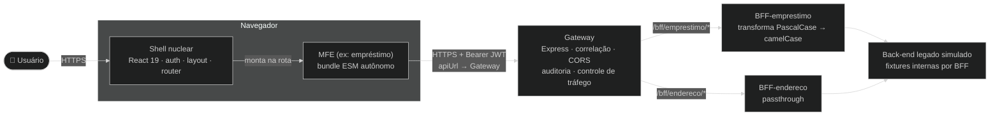

# Infra, ADR-015 e Documentação Implementation Plan

> **For agentic workers:** REQUIRED SUB-SKILL: Use superpowers:subagent-driven-development (recommended) or superpowers:executing-plans to implement this plan task-by-task. Steps use checkbox (`- [ ]`) syntax for tracking.

**Goal:** Conteinerizar `gateway/`, `bffs/emprestimo/` e `bffs/endereco/`, orquestrá-los via `infra/docker-compose.yml`, documentar a decisão em ADR-015 e atualizar o `README.md` raiz para refletir a nova topologia.

**Architecture:** Um `Dockerfile` de estágio único por serviço (Node 20-alpine, mesma versão do estágio de build do `Dockerfile` raiz), rodando via `node --experimental-strip-types` — sem etapa de compilação, mesma técnica já usada em dev. Os três serviços entram em `infra/docker-compose.yml`, na mesma rede padrão do Compose que já sobe o LocalStack, resolvendo-se entre si por nome de serviço (`bff-emprestimo`, `bff-endereco`). A ADR-015 documenta a decisão seguindo o template já usado nas ADRs 008–014.

**Tech Stack:** Docker, Docker Compose, Markdown/Mermaid (ADR).

## Global Constraints

- Pré-requisito: os planos `2026-07-05-gateway-core.md`, `2026-07-05-bff-endereco.md` e `2026-07-05-bff-emprestimo.md` já foram executados — `gateway/`, `bffs/emprestimo/` e `bffs/endereco/` existem, cada um com `package.json`, `package-lock.json` e `src/index.ts` funcionando via `npm run dev`.
- `Dockerfile` de cada serviço não roda testes nem type-check — só instala dependências de produção e sobe o processo. Testes/type-check continuam sendo responsabilidade do fluxo de CI local (`npm test`, `npm run type-check` dentro de cada pacote).
- Sem placeholders: todo arquivo criado abaixo tem conteúdo completo.
- Este plano não introduz nenhum script novo em `package.json` da raiz — comandos de cada serviço são documentados como `cd <pasta> && npm run dev`, no mesmo estilo já usado para os MFEs (`cd mfes/<id> && npm run deploy`).

---

### Task 1: `Dockerfile` para os três serviços

**Files:**
- Create: `gateway/Dockerfile`
- Create: `bffs/emprestimo/Dockerfile`
- Create: `bffs/endereco/Dockerfile`

**Interfaces:**
- Consumes: `package.json`/`package-lock.json`/`src/` de cada serviço (já existentes, dos três planos anteriores).
- Produces: imagens Docker que expõem, respectivamente, as portas `4000`, `4001` e `4002` — consumidas pelo `infra/docker-compose.yml` (Task 2).

- [ ] **Step 1: Criar `gateway/Dockerfile`**

```dockerfile
FROM node:20-alpine
WORKDIR /app

COPY package*.json ./
RUN npm ci --omit=dev

COPY src ./src

EXPOSE 4000
CMD ["node", "--experimental-strip-types", "src/index.ts"]
```

- [ ] **Step 2: Criar `bffs/emprestimo/Dockerfile`**

```dockerfile
FROM node:20-alpine
WORKDIR /app

COPY package*.json ./
RUN npm ci --omit=dev

COPY src ./src

EXPOSE 4001
CMD ["node", "--experimental-strip-types", "src/index.ts"]
```

- [ ] **Step 3: Criar `bffs/endereco/Dockerfile`**

```dockerfile
FROM node:20-alpine
WORKDIR /app

COPY package*.json ./
RUN npm ci --omit=dev

COPY src ./src

EXPOSE 4002
CMD ["node", "--experimental-strip-types", "src/index.ts"]
```

- [ ] **Step 4: Buildar cada imagem isoladamente e confirmar sucesso**

Run:
```bash
docker build -t gateway-test ./gateway
docker build -t bff-emprestimo-test ./bffs/emprestimo
docker build -t bff-endereco-test ./bffs/endereco
```
Expected: as três builds terminam com `Successfully tagged ...` (ou equivalente do BuildKit), sem erro de `npm ci`.

- [ ] **Step 5: Commit**

```bash
git add gateway/Dockerfile bffs/emprestimo/Dockerfile bffs/endereco/Dockerfile
git commit -m "feat(infra): Dockerfile para gateway e BFFs"
```

---

### Task 2: `infra/docker-compose.yml` — orquestrar Gateway + BFFs

**Files:**
- Modify: `infra/docker-compose.yml`

**Interfaces:**
- Consumes: `gateway/Dockerfile`, `bffs/emprestimo/Dockerfile`, `bffs/endereco/Dockerfile` (Task 1).
- Produces: os três serviços acessíveis em `http://localhost:4000` (gateway), `http://localhost:4001` (bff-emprestimo) e `http://localhost:4002` (bff-endereco) a partir do host; entre si, resolvem-se pelo nome do serviço na rede padrão do Compose (ex.: `http://bff-emprestimo:4001`).

- [ ] **Step 1: Ler o arquivo atual**

Run: `cat infra/docker-compose.yml`

Conteúdo atual (para referência — não remover):

```yaml
services:
  localstack:
    image: localstack/localstack:3
    ports:
      - "4566:4566"
    environment:
      - SERVICES=s3
      - DEBUG=0
    volumes:
      - "./.localstack:/var/lib/localstack"
      - "/var/run/docker.sock:/var/run/docker.sock"
```

- [ ] **Step 2: Adicionar os três serviços ao final do arquivo**

Reescrever `infra/docker-compose.yml` para:

```yaml
services:
  localstack:
    image: localstack/localstack:3
    ports:
      - "4566:4566"
    environment:
      - SERVICES=s3
      - DEBUG=0
    volumes:
      - "./.localstack:/var/lib/localstack"
      - "/var/run/docker.sock:/var/run/docker.sock"

  bff-emprestimo:
    build:
      context: ../bffs/emprestimo
    ports:
      - "4001:4001"
    environment:
      - PORT=4001

  bff-endereco:
    build:
      context: ../bffs/endereco
    ports:
      - "4002:4002"
    environment:
      - PORT=4002

  gateway:
    build:
      context: ../gateway
    ports:
      - "4000:4000"
    environment:
      - PORT=4000
      - CORS_ORIGIN=http://localhost:5173
      - BFF_EMPRESTIMO_URL=http://bff-emprestimo:4001
      - BFF_ENDERECO_URL=http://bff-endereco:4002
    depends_on:
      - bff-emprestimo
      - bff-endereco
```

- [ ] **Step 3: Subir a stack e verificar os três serviços**

Run:
```bash
docker compose -f infra/docker-compose.yml up -d --build
docker compose -f infra/docker-compose.yml ps
```
Expected: `localstack`, `bff-emprestimo`, `bff-endereco` e `gateway` com status `running`/`Up`.

- [ ] **Step 4: Confirmar o roteamento entre containers**

Run:
```bash
curl -i http://localhost:4000/bff/endereco/usuario/endereco
curl -i http://localhost:4000/bff/emprestimo/contratos
```
Expected: ambos retornam `HTTP/1.1 200` com o corpo esperado de cada BFF — prova que o Gateway, rodando em container, alcança os BFFs pelo nome do serviço (`bff-endereco`, `bff-emprestimo`), não por `localhost`.

- [ ] **Step 5: Encerrar a stack**

Run: `docker compose -f infra/docker-compose.yml down`

- [ ] **Step 6: Commit**

```bash
git add infra/docker-compose.yml
git commit -m "feat(infra): orquestra Gateway e BFFs no docker-compose"
```

---

### Task 3: ADR-015 — Gateway de API com BFFs

**Files:**
- Create: `docs/architecture/adrs/ADR-015-gateway-api-e-bff.md`

**Interfaces:**
- Consumes: nenhuma interface de código — documenta a decisão já implementada nos três planos anteriores.
- Produces: registro arquitetural referenciado pelo `README.md` raiz (Task 4) e pelos `README.md` de `gateway/`, `bffs/emprestimo/` e `bffs/endereco/` (já criados nos planos anteriores, cada um linkando para esta ADR).

- [ ] **Step 1: Criar `docs/architecture/adrs/ADR-015-gateway-api-e-bff.md`**

```markdown
# ADR-015: Gateway de API com BFFs

## Contexto e Problema

Desde a ADR-008, cada MFE "se comunica apenas com o back-end, nunca com outros MFEs", via `apiUrl`. Isso significa que, hoje, cada MFE fala diretamente com o formato do back-end legado — no caso do MFE de empréstimo, um contrato `.svc` em PascalCase que "espelha o payload do servidor" (ver `mfes/emprestimo/src/dto/index.ts`). Não há, em lugar nenhum da plataforma, um ponto único onde se possa auditar o tráfego entre os MFEs e o back-end, nem aplicar controle de taxa de requisições — cada MFE fala diretamente com a rede externa.

**Pergunta-problema:** Como introduzir um ponto único de borda entre os MFEs e o back-end, capaz de auditar tráfego e aplicar controle de taxa, sem obrigar cada MFE a conhecer o formato bruto do back-end legado?

## Drivers

- **Desacoplamento de contrato**: MFEs não deveriam conhecer o formato legado (`.svc`, PascalCase) do back-end — cada um deveria falar um contrato pensado para si.
- **Visibilidade de tráfego**: nenhum componente da plataforma hoje audita quem chamou o quê, quando, com que status e duração.
- **Proteção contra sobrecarga**: nenhum componente aplica limite de requisições — um MFE com bug (loop de chamadas, por exemplo) pode saturar o back-end sem controle algum.
- **Extensibilidade**: novos MFEs devem poder ganhar seu próprio adaptador de contrato sem alterar os já existentes.

### Aderência a Princípios

| Princípio | Aderência | Impacto |
|-----------|-----------|---------|
| Separação de responsabilidades | ✅ | Gateway cuida de borda (auditoria/tráfego); BFF cuida de contrato por MFE |
| Baixo acoplamento | ✅ | MFE não conhece mais o formato do back-end legado, só o contrato do seu BFF |
| Abertura para extensão | ✅ | Novo MFE = novo BFF + nova entrada de roteamento no Gateway |
| Ponto único de falha | ⚠️ | Gateway e BFFs são novos componentes na cadeia — ver Riscos |

## Stakeholders (RACI)

- **Deciders (A)**: arquiteto de software do projeto
- **Consulted (C)**: equipes de funcionalidades (donas dos MFEs), plataforma
- **Informed (I)**: demais membros do projeto

## Opções Consideradas

### Opção 1: Gateway (auditoria + controle de tráfego) + um BFF por MFE (transformação de mensagem) — escolhida

Um Gateway único recebe toda requisição dos MFEs, aplica correlação, controle de tráfego e auditoria, e roteia por prefixo de path (`/bff/<nome>`) para o BFF do MFE correspondente. Cada BFF adapta o contrato do seu MFE — no caso do empréstimo, transformando o payload legado em PascalCase para um contrato limpo em camelCase; no caso do endereço, atuando como passthrough (o contrato já é limpo).

- ✅ **Prós**: cada responsabilidade (borda vs. contrato) tem um dono único; controle de tráfego e auditoria não se duplicam por BFF; extensível a novos MFEs
- ❌ **Contras**: dois tipos de serviço novos para operar (Gateway, BFF); um hop de rede a mais por requisição
- 💰 **Custo**: implementação e manutenção de 3 serviços novos (recorrente); refactor do MFE de empréstimo para o novo contrato (custo único)

### Opção 2: Gateway como proxy fino; cada BFF implementa as três responsabilidades

O Gateway apenas roteia por path; cada BFF audita, aplica seu próprio limite de tráfego e transforma sua mensagem.

- ✅ **Prós**: cada BFF é autocontido, sem depender do Gateway para nada além de roteamento
- ❌ **Contras**: auditoria e controle de tráfego duplicados em cada BFF; nenhum ponto único para consultar o tráfego da plataforma como um todo; novo BFF precisa reimplementar as três responsabilidades

### Opção 3: BFFs expostos diretamente, sem Gateway (`apiUrl` do MFE aponta direto para o BFF)

Cada MFE aponta `apiUrl` direto para seu BFF; não há componente comum de borda.

- ✅ **Prós**: menos um serviço na cadeia; um hop de rede a menos
- ❌ **Contras**: nenhum ponto único de auditoria ou controle de tráfego — cada BFF precisaria implementar (e manter) essas responsabilidades por conta própria, ou elas simplesmente não existiriam

### Opção 4: Status quo — MFE fala direto com o back-end legado (baseline)

Manter o comportamento da ADR-008: cada MFE conhece o formato do back-end e fala com ele diretamente.

- ✅ **Prós**: zero serviços novos; zero refactor
- ❌ **Contras**: nenhuma auditoria, nenhum controle de tráfego, acoplamento permanente ao formato legado

## Decisão

**Escolhida: Opção 1 — Gateway (auditoria + controle de tráfego) + um BFF por MFE (transformação de mensagem).**

### Y-Statement

> **No contexto de** uma plataforma de microfrontends que hoje expõe o contrato de back-end legado diretamente a cada MFE, sem nenhum ponto único de auditoria ou controle de tráfego,
> **enfrentando** o acoplamento entre MFEs e o formato legado (PascalCase, `.svc`) e a ausência de visibilidade/proteção na borda da plataforma,
> **decidimos por** introduzir um Gateway de API — responsável por correlação, controle de tráfego e auditoria — na frente de um BFF por MFE, responsável por adaptar o contrato de cada um,
> **para alcançar** desacoplamento do formato legado, visibilidade de tráfego e proteção contra sobrecarga,
> **aceitando** um hop de rede adicional e a operação de mais dois tipos de serviço (Gateway, BFFs).

### Justificativa

Concentrar auditoria e controle de tráfego no Gateway evita duplicar essas responsabilidades em cada BFF (descarta Opção 2) e garante que existam mesmo que um BFF futuro seja adicionado sem essa preocupação em mente. Manter a transformação de mensagem no BFF (não no Gateway) preserva o Gateway como componente genérico, sem conhecimento de contrato de nenhum MFE específico. Um Gateway comum, e não BFFs expostos diretamente (Opção 3), é o que torna possível auditar e limitar tráfego de toda a plataforma a partir de um único lugar.

### Diagrama — Containers com Gateway e BFFs



## Consequências

### Positivas

- ✅ MFEs deixam de conhecer o formato do back-end legado — falam apenas o contrato do seu BFF
- ✅ Toda requisição que atravessa a plataforma é auditada em um único lugar (`gateway/logs/audit.log`)
- ✅ Controle de tráfego protege os BFFs de sobrecarga, sem que cada um precise implementá-lo

### Negativas (trade-offs aceitos)

- ❌ Um hop de rede adicional (MFE → Gateway → BFF) em toda requisição
- ❌ Refactor do MFE de empréstimo: contrato de API, tipos de domínio e todas as telas que liam o payload legado diretamente
- ❌ Três serviços novos para rodar/operar localmente (Gateway, BFF-emprestimo, BFF-endereco)

### Neutras (mudanças necessárias)

- 🔄 `apiUrl` (config global do shell) passa a apontar para o Gateway, não mais para o back-end legado diretamente
- 🔄 O MSW do shell (`src/mocks/`) permanece intocado, para quem quiser rodar o front isoladamente sem subir Gateway+BFFs

### Riscos

| Risco | L | I | Mitigação | Owner |
|-------|---|---|-----------|-------|
| Gateway/BFFs indisponíveis derrubam toda a plataforma | M | H | Fora de escopo mitigar neste estudo (sem HA/observabilidade distribuída) — risco aceito e registrado | Arquiteto |
| Duplicação de fixtures entre MSW do shell e fixtures internas dos BFFs diverge com o tempo | M | L | Aceito conscientemente — simulam consumidores diferentes (dev de front-end vs. runtime de BFF) | Plataforma |
| Refactor do MFE de empréstimo introduz regressão de comportamento | M | M | Cobertura de teste ≥80% mantida antes/depois da migração; smoke test ponta a ponta via Gateway | Equipe do MFE |

## Validação

- [ ] MFE de empréstimo funciona ponta a ponta (login → contratos → propostas → simulação) através de Gateway + BFF-emprestimo
- [ ] MFE de endereço funciona ponta a ponta através de Gateway + BFF-endereco
- [ ] Requisição que excede o limite de tráfego recebe `429` do Gateway, sem chegar ao BFF
- [ ] Toda requisição que passa pelo Gateway gera uma linha em `gateway/logs/audit.log` com `correlationId` rastreável na resposta
- [ ] Nenhum código do MFE de empréstimo lê mais campos PascalCase do contrato legado

## Links

- Spec: [`docs/superpowers/specs/2026-07-05-gateway-bff-design.md`](../../superpowers/specs/2026-07-05-gateway-bff-design.md)
- Planos: [`2026-07-05-gateway-core.md`](../../superpowers/plans/2026-07-05-gateway-core.md), [`2026-07-05-bff-endereco.md`](../../superpowers/plans/2026-07-05-bff-endereco.md), [`2026-07-05-bff-emprestimo.md`](../../superpowers/plans/2026-07-05-bff-emprestimo.md)
- Código: [`gateway/`](../../../gateway/README.md), [`bffs/emprestimo/`](../../../bffs/emprestimo/README.md), [`bffs/endereco/`](../../../bffs/endereco/README.md)
- ADRs relacionadas: ADR-004 (autenticação — token Bearer atravessa o novo hop sem alteração), ADR-008 (microfrontends dinâmicos — revisita "MFE fala só com o back-end")

## Revisão

- Revisão futura: 2027-01-05
- Triggers: terceiro BFF adicionado à plataforma, necessidade de observabilidade distribuída (tracing) entre Gateway e BFFs, integração com um back-end real de produção

## Histórico

| Versão | Data | Autor | Mudanças |
|--------|------|-------|----------|
| 1.0 | 2026-07-05 | Marco Mendes | Versão inicial |
```

- [ ] **Step 2: Commit**

```bash
git add docs/architecture/adrs/ADR-015-gateway-api-e-bff.md
git commit -m "docs(arquitetura): ADR-015 — Gateway de API com BFFs"
```

---

### Task 4: Atualizar o `README.md` raiz

**Files:**
- Modify: `README.md`

**Interfaces:**
- Consumes: nenhuma — só documentação.

- [ ] **Step 1: Atualizar o parágrafo de Conceito**

Localizar, em `README.md`, o parágrafo que termina em "...empacota o próprio React e se comunica apenas com o back-end (via `apiUrl`), nunca com outros MFEs." e adicionar a frase seguinte ao final do parágrafo:

```markdown
A partir da ADR-015, "o back-end" é o Gateway de API — que roteia, audita e aplica controle de tráfego antes de encaminhar cada requisição ao BFF do MFE correspondente.
```

- [ ] **Step 2: Atualizar a árvore de "Estrutura do repositório"**

No bloco de árvore de diretórios do README, adicionar `gateway/` e `bffs/` logo após a entrada de `mfes/`:

```
├── mfes/
│   ├── endereco/             ← MFE autônomo (package.json/vite/vitest/deploy próprios)
│   └── emprestimo/           ← MFE autônomo
├── gateway/                  ← Gateway de API (Express) — porta única de entrada (ADR-015)
├── bffs/
│   ├── emprestimo/           ← BFF do MFE de empréstimo — transforma o contrato legado
│   └── endereco/             ← BFF do MFE de endereço
├── infra/                    ← docker-compose com LocalStack (S3) e Gateway+BFFs
```

- [ ] **Step 3: Adicionar linha à tabela de ADRs**

Na tabela "Decisões arquiteturais (ADRs)", adicionar, após a linha da ADR-014:

```markdown
| [ADR-015](docs/architecture/adrs/ADR-015-gateway-api-e-bff.md) | **Gateway de API com BFFs** |
```

- [ ] **Step 4: Adicionar linhas à tabela "Documentação por módulo"**

Na tabela "Documentação por módulo", adicionar:

```markdown
| Gateway de API | Roteamento, correlação, auditoria e controle de tráfego | [`gateway/README.md`](gateway/README.md) |
| BFF de empréstimo | Transformação de contrato legado → limpo | [`bffs/emprestimo/README.md`](bffs/emprestimo/README.md) |
| BFF de endereço | Passthrough do contrato de endereço | [`bffs/endereco/README.md`](bffs/endereco/README.md) |
```

- [ ] **Step 5: Atualizar a seção "Configuração externa e variáveis de ambiente"**

Após a linha da tabela `| \`apiUrl\` | ... |`, adicionar o parágrafo:

```markdown
Para rodar a plataforma completa com Gateway e BFFs (ver ADR-015), aponte `apiUrl` para o Gateway: `"apiUrl": "http://localhost:4000"`. Sem Gateway/BFFs no ar, mantenha `apiUrl` vazio para usar o MSW.
```

- [ ] **Step 6: Adicionar seção de comandos para Gateway/BFFs**

Após a seção "Rodando a plataforma completa (shell + MFE + S3)", adicionar uma nova seção:

```markdown
## Rodando Gateway + BFFs (ADR-015)

Em três terminais separados, na raiz do repositório:

```bash
cd bffs/endereco && npm install && npm run dev    # http://localhost:4002
cd bffs/emprestimo && npm install && npm run dev  # http://localhost:4001
cd gateway && npm install && npm run dev          # http://localhost:4000
```

Ou via Docker Compose, subindo os três de uma vez:

```bash
docker compose -f infra/docker-compose.yml up -d --build gateway bff-emprestimo bff-endereco
```

Com o Gateway no ar, configure `dist/config.json` (ou `public/config.json` em dev) com `"apiUrl": "http://localhost:4000"` e suba o shell normalmente (`npm run dev`).
```

- [ ] **Step 7: Atualizar o checklist de implantação**

Na seção "Checklist de implantação", após o item 6 ("Configurar `dist/config.json`"), adicionar:

```markdown
6.1. Se usando Gateway+BFFs (ADR-015): publicar as três imagens (`gateway/Dockerfile`, `bffs/emprestimo/Dockerfile`, `bffs/endereco/Dockerfile`) e apontar `apiUrl` do `config.json` para a URL pública do Gateway
```

- [ ] **Step 8: Revisar o README renderizado**

Run: `cat README.md | head -100` (ou abrir no editor) e confirmar visualmente que as tabelas continuam com formatação Markdown válida (colunas alinhadas, sem `|` quebrado).

- [ ] **Step 9: Commit**

```bash
git add README.md
git commit -m "docs: documenta Gateway e BFFs no README raiz (ADR-015)"
```

---

## Self-Review (registrado para o executor)

- **Cobertura do spec:** Dockerfiles + docker-compose (seção "Infraestrutura" do spec), ADR-015 (seção "Documentação" do spec) e atualização do README raiz (idem) — as três entregas documentais/infra do spec estão cobertas.
- **Sem placeholders:** todo arquivo criado tem conteúdo completo; os patches de README mostram o texto exato a inserir e onde.
- **Consistência:** portas e nomes de serviço no `docker-compose.yml` (Task 2) batem com os defaults já definidos em `gateway/src/config.ts` (`BFF_EMPRESTIMO_URL=http://localhost:4001`, `BFF_ENDERECO_URL=http://localhost:4002`) — dentro do Compose, os mesmos nomes de serviço (`bff-emprestimo`, `bff-endereco`) substituem `localhost` via variável de ambiente, sem precisar alterar código.
- **Entregável independente:** ao final deste plano, `docker compose -f infra/docker-compose.yml up -d --build` sobe LocalStack + Gateway + os dois BFFs, com o Gateway respondendo corretamente através da rede interna do Compose (Task 2, Step 4) — verificável sem depender de nenhum outro plano além dos três já executados.
