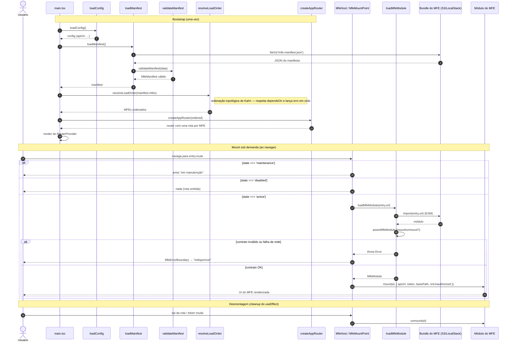

# Runtime de Microfrontends (camada `app`)

Motor que carrega MFEs (microfrontends) autônomos a partir de buckets S3 (Amazon Simple Storage Service) em runtime. Ver ADR-008/009/010.

| Arquivo | Responsabilidade | Decisão |
|---------|------------------|---------|
| [`types.ts`](types.ts) | Tipos do manifesto e do contrato `MfeMountContext`/`MfeModule` | ADR-009 |
| [`manifest.ts`](manifest.ts) | Validação fail-fast do manifesto | ADR-010 |
| [`dependencyResolver.ts`](dependencyResolver.ts) | Ordenação topológica + detecção de ciclo | ADR-010 |
| [`loadManifest.ts`](loadManifest.ts) | Carrega `public/mfe-manifest.json` via fetch | ADR-010 |
| [`loadMfeModule.ts`](loadMfeModule.ts) | `import()` ESM (ECMAScript Modules — módulos nativos do JavaScript) do bundle + validação do contrato | ADR-009 |
| [`MfeHost.tsx`](MfeHost.tsx) | Monta/desmonta o MFE numa `
`; injeta o contexto | ADR-009 |
| [`MfeErrorBoundary.tsx`](MfeErrorBoundary.tsx) | Isola falhas de um MFE do shell | ADR-008 |

## Dinâmica de carga dinâmica

O carregamento acontece em dois momentos: o **bootstrap** (uma vez, em `main.tsx`),
que resolve o manifesto e a ordem de dependências, e o **mount sob demanda**, quando
o usuário navega para a rota de um MFE e o `MfeHost` faz o `import()` do bundle.

Pontos-chave do diagrama:

- **Fail-fast no bootstrap**: manifesto inválido ou ciclo de dependência derrubam o
  boot do shell (tela de erro em `main.tsx`), antes de qualquer MFE montar.
- **Isolamento por MFE**: falha de rede, contrato quebrado ou erro de runtime de um
  MFE ficam contidos no `MfeErrorBoundary` — o shell e os demais MFEs seguem vivos.
- **Contrato `mount`/`unmount`** (ADR-009): o `MfeMountPoint` injeta o
  `MfeMountContext` (`apiUrl`, `token`, `basePath`, `onUnauthorized`) e desmonta no
  cleanup do `useEffect` quando a rota muda ou o token é atualizado.
